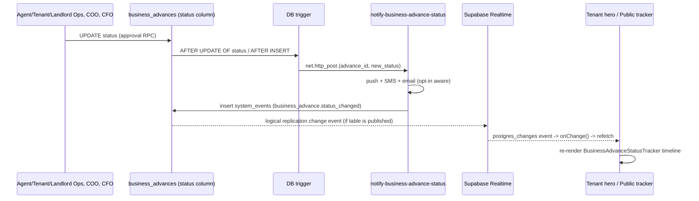

# Welile — Business Advance: Real-Time Architecture

Audience: engineers, operations, future AI assistants.
Companion documents: `SYSTEM_CONTEXT.md` §6.2 (product summary), `docs/FINANCIAL_SYSTEM_ARCHITECTURE.md` (ledger invariants).

> Method: read from `src/hooks/useBusinessAdvanceRealtime.ts`, `src/hooks/useBusinessAdvanceCommissionListener.ts`, the `business-advance/*` and `tenant/BusinessAdvanceStatusHero.tsx` components, `supabase/functions/notify-business-advance-status`, `supabase/functions/business-advance-stage-reminders`, and cross-checked against the **live production database** (`pg_publication_tables`, `pg_trigger`, `cron.job`) on 2026-09-18. Where the repo migration files and live production disagree, live production is called out explicitly.

---

## 1. What "real-time" means here

Business Advance has **two independent real-time mechanisms** that are easy to conflate:

1. **Live status tracker** — the tenant dashboard hero (`BusinessAdvanceStatusHero.tsx`) and the public, unauthenticated tracker page (`/business-advance/track`, `BusinessAdvanceTrack.tsx`) both want to reflect the `business_advances` row's current approval stage without the user refreshing the page.
2. **Commission celebration toast** — an agent's UI should pop a small celebration when their tenant makes a repayment on a Business Advance (`useBusinessAdvanceCommissionListener.ts`).

Both are built on **Supabase Realtime** (`postgres_changes` over a websocket), but they subscribe to **different tables with different production wiring**, and only one of them is confirmed working end-to-end in production today. See §4.

---

## 2. Live status tracker

### 2.1 The shared hook — `useBusinessAdvanceRealtime`

`src/hooks/useBusinessAdvanceRealtime.ts` is the single reusable primitive. Every consumer (`BusinessAdvanceStatusHero`, `BusinessAdvanceTrack`, `BusinessAdvanceAuditLog`) calls it the same way:

```ts
const rtStatus = useBusinessAdvanceRealtime(
  channelKey,          // unique string, or null to stay idle
  onChange,             // callback — always a REFETCH, never reads the payload
  { filter: 'tenant_id=eq.<uuid>' }   // optional, server-side row filter
);
```

It does **not** hand back row data. `onChange` is a trigger to re-run whatever fetch the caller already has (`refetch()` from React Query, or a hand-rolled `load()` / `fetchLog()`). This is a deliberate simplification: because `business_advances` is not `REPLICA IDENTITY FULL` (see §4.2), the `payload.new` a Postgres change event would carry is not guaranteed complete, so nobody relies on it — every consumer just re-queries via RPC or a Supabase `select`.

Behavior:

| Phase | What happens |
|---|---|
| Mount | Opens a channel `business-advance-rt-<channelKey>`, subscribes to `postgres_changes` (`event: '*'`) on `public.business_advances`, with the optional `filter`. Status = `connecting`. |
| `SUBSCRIBED` reached | Status = `live`. If this is a *reconnect* after a prior drop, shows a "Live updates reconnected" toast. |
| `CHANNEL_ERROR` / `TIMED_OUT` / `CLOSED` | Shows a one-time "Live updates paused" toast, degrades to a **15-second polling fallback** (`setInterval(onChange, 15000)`), status = `polling`. |
| 10s with no `SUBSCRIBED` | Hard timeout — same polling fallback kicks in even without an explicit error, status = `polling`. |
| Unmount | Clears timers, removes the channel. |

`LiveUpdatingBadge.tsx` renders `connecting` / `live` / `polling` as a small pill (spinner / pulsing green dot / amber refresh icon) so operators and tenants can see which mode they're in — this was clearly built anticipating that the websocket path might not always work.

### 2.2 Consumers

| Component | Channel key | Filter | Triggers on |
|---|---|---|---|
| `BusinessAdvanceStatusHero.tsx` (tenant dashboard) | `tenant-hero-<userId>` | `tenant_id=eq.<userId>` | any row change → `refetch()` a React Query keyed `['tenant-active-business-advance', userId]`, which re-runs a `business_advances` select (RLS-scoped) |
| `BusinessAdvanceTrack.tsx` (public, unauthenticated `/business-advance/track?phone=`) | `public-track-<phone>` | none (no auth context to filter server-side) | any row change → `load()`, which calls the SECURITY DEFINER RPC `get_business_advance_public_status(p_phone)` |
| `BusinessAdvanceAuditLog.tsx` (expandable panel under the tracker) | `audit-<advanceId>` (only while the panel is open) | none | any row change → `fetchLog()`, which calls RPC `get_business_advance_audit_log(p_advance_id, p_phone)` |

The public tracker's channel has no `filter` because an anonymous visitor has no JWT claim to scope against — it listens to *all* `business_advances` changes and re-runs the phone-scoped RPC on every tick. This is wasteful at scale (every visitor's browser wakes up on every advance's status change) but is bounded by the fact that Business Advance volume is low and each `onChange` is a cheap indexed RPC call, not a raw table read.

### 2.3 End-to-end flow (as designed)



### 2.4 The approval chain the timeline renders

`BusinessAdvanceStatusTracker.tsx` renders a fixed 7-stage timeline driven purely by which timestamp columns on the row are non-null (`STAGES` array): `created_at` → `agent_ops_reviewed_at` → `tenant_ops_reviewed_at` → `landlord_ops_reviewed_at` → `coo_approved_at` → `disbursed_at` → `completed_at`. It has no realtime logic of its own — it's a pure function of whatever row its parent passes in, refreshed each time `onChange` fires. `rejected` / `defaulted` statuses short-circuit the whole timeline into a single rejection callout.

---

## 3. Commission celebration listener

`useBusinessAdvanceCommissionListener.ts` is a separate, simpler subscription used on **agent** dashboards:

```ts
supabase
  .channel(`business-advance-commission-${user.id}`)
  .on('postgres_changes', {
    event: 'INSERT',
    schema: 'public',
    table: 'business_advance_repayments',
    filter: `agent_id=eq.${user.id}`,
  }, handler)
  .subscribe();
```

Unlike the status tracker, this one **does** read the payload (`payload.new.agent_commission`, `.amount`, `.advance_id`) directly — no polling fallback, no reconnect handling, "pure realtime" per its own comment. When a repayment INSERT lands with `agent_commission > 0`, it looks up the business name (cached in a `Map` to avoid refetching per event) and surfaces a `CommissionEvent` for `CommissionCelebrationModal.tsx` to animate.

This listener has no `LiveUpdatingBadge` and no degrade path — if the websocket never connects, agents simply never see the celebration modal. It is decorative (does not gate any money movement; the ledger legs for `agent_repayment` / `business_advance_repayments` are booked by `repay-business-advance` regardless of whether any UI is listening).

---

## 4. Production wiring — verified, not assumed

This is the part that diverges from what the code *implies*. Per `CLAUDE.md`'s standing gotcha that `supabase/migrations/` doesn't faithfully reflect live production, the following was checked directly against the live database on 2026-09-18.

### 4.1 Realtime publication membership

```sql
select tablename from pg_publication_tables
where pubname = 'supabase_realtime' and tablename like 'business_advance%';
```

**Result: only `business_advance_repayments` is in the publication.** `business_advances` and `business_advance_daily_accruals` are **not**.

Consequence: the commission listener (§3) is fully wired and will receive real, live `INSERT` events. The status tracker (§2) subscribes to a table that Postgres logical replication will never emit change events for. The websocket channel handshake can still reach `SUBSCRIBED` (that only requires the channel join to succeed, not that the table is published) — so `LiveUpdatingBadge` can show **"Live updating" while in fact no status-change event will ever arrive that way.** In practice, the tenant hero and public tracker currently only refresh when:

- the component first mounts (initial `load()` / `useQuery`), or
- the websocket connection genuinely drops (`CHANNEL_ERROR` / `TIMED_OUT` / `CLOSED`) or never reaches `SUBSCRIBED` within 10s, tripping the 15-second polling fallback, or
- the user manually reloads the page.

The polling fallback is the only thing standing between "instant update" and "user has to refresh." Whether it engages is a function of transient websocket reliability, not a deliberate design choice — the intended path (direct `postgres_changes` on `business_advances`) is not live.

**Fix, if wanted:** add the table to the publication. This is a one-line, low-risk migration:

```sql
ALTER PUBLICATION supabase_realtime ADD TABLE public.business_advances;
```

(`REPLICA IDENTITY` does not need to change — nothing here reads `payload.new`/`payload.old`, so the default identity, primary-key-only, is sufficient.) Not applied as part of this documentation pass — flagging for a decision rather than silently changing live replication config.

### 4.2 Replica identity

```sql
select relname, relreplident from pg_class
where relname in ('business_advances','business_advance_repayments','business_advance_daily_accruals');
```

All three are `d` (default = primary key only), not `f` (full). This is consistent with §2.1 — no consumer trusts the change payload's row contents, they only use the event as a "something changed, go refetch" signal.

### 4.3 The notification trigger chain

```sql
select tgname, pg_get_triggerdef(oid) from pg_trigger
where tgrelid = 'public.business_advances'::regclass and not tgisinternal;
```

Confirmed live and matching `supabase/migrations/20260517155554_...sql`:

- `on_business_advance_insert_notify_tenant` — `AFTER INSERT`
- `on_business_advance_status_notify_tenant` — `AFTER UPDATE OF status`
- `update_business_advances_updated_at` — generic `updated_at` bookkeeping

Both notify triggers call `net.http_post` (Supabase's async HTTP-from-Postgres extension) against `notify-business-advance-status`, which is genuinely real-time in the sense that it fires synchronously off the same transaction that changed the row (fire-and-forget — failure is swallowed by an `EXCEPTION WHEN OTHERS` block so a notification outage can never block the underlying approval). That edge function is what actually delivers "real-time-feeling" updates to the tenant today — **push notification, SMS, and email**, independent of whether the browser tab is open or the websocket is connected. It also writes a `system_events` row tagged `business_advance.status_changed`, which its own inline comment says "drives realtime tracker + activity feed" — but nothing in the frontend currently subscribes to `system_events` for Business Advance; the comment describes an intended integration that isn't wired up on the client side.

### 4.4 Scheduled jobs

```sql
select jobname, schedule, active from cron.job where jobname ilike '%business-advance%';
```

| Job | Schedule | Purpose |
|---|---|---|
| `business-advance-stage-reminders` | `*/30 * * * *` (every 30 min) | Per `REMINDER_RULES` in the edge function, nudges the tenant by SMS/email once a stage has sat open past its typical SLA (`etaHours`: 6h Agent Ops, 24h Tenant Ops, 48h Landlord Ops, 24h COO, 12h disbursement) |
| `business-advance-daily-compounding` | `0 23 * * *` (23:00 UTC) | `process-business-advance-compounding` — accrues daily interest on active advances into `business_advance_daily_accruals` |

Both confirmed `active: true` in production.

---

## 5. Notification preferences (opt-in gate)

`BusinessAdvanceNotificationPreferences.tsx` (`src/components/business-advance/NotificationPreferences.tsx`) lets the tenant toggle `profiles.business_advance_notify_sms` / `business_advance_notify_email`. `notify-business-advance-status` reads both flags (`!== false`, i.e. opt-out rather than opt-in by default) before sending, and logs every attempt — sent/failed/skipped/opted_out — to `business_advance_notification_log` with the provider's raw response, so delivery can be audited per stage transition.

---

## 6. Practical implementation checklist

If you're wiring a **new** real-time surface for Business Advance (e.g. an ops-side queue that should update live as advances move through stages):

1. **Reuse `useBusinessAdvanceRealtime`** — don't write a new channel/subscribe/fallback dance. Pass a scoped `filter` when you have a server-side predicate (agent_id, tenant_id); omit it only for genuinely unscoped/anonymous views.
2. **Treat `onChange` as "go refetch," never as row data.** Keep it that way even if you're tempted to read `payload.new` — the table isn't `REPLICA IDENTITY FULL`, so `payload.old` will be sparse and `payload.new` isn't a contract anyone else here relies on.
3. **Check the publication before assuming it's live.** `select tablename from pg_publication_tables where pubname='supabase_realtime'` against production (see §4.1) — a component can look "wired" and still be functionally poll-only.
4. **Don't duplicate the notification trigger.** Status-change push/SMS/email is already centralized in `notify_tenant_on_business_advance_status()` / `_insert()` → `notify-business-advance-status`. If you need a new channel (e.g. Slack-to-ops), add it inside that edge function rather than a second trigger, so `business_advance_notification_log` stays the single audit source.
5. **Respect the opt-out flags** (`business_advance_notify_sms` / `_email`) for any new outbound channel you add.
6. **New tables need explicit realtime opt-in.** `ALTER PUBLICATION supabase_realtime ADD TABLE ...` is not automatic on table creation — §4.1 is a live example of a table that shipped without it.

---

## 7. Known gap (not yet fixed)

**`business_advances` itself is not in the `supabase_realtime` publication in production**, so the primary "live status tracker" silently runs on its polling fallback (or on mount-only refresh) rather than true push updates, despite `LiveUpdatingBadge` being capable of showing "Live updating." Tenants still get near-real-time delivery through the SMS/email/push side-channel (§4.3), so this is a UX/perf gap, not a data-integrity one — but it means the in-app timeline can lag behind what the tenant's phone already told them. See §4.1 for the one-line fix; not applied here pending a decision on whether to take it.
