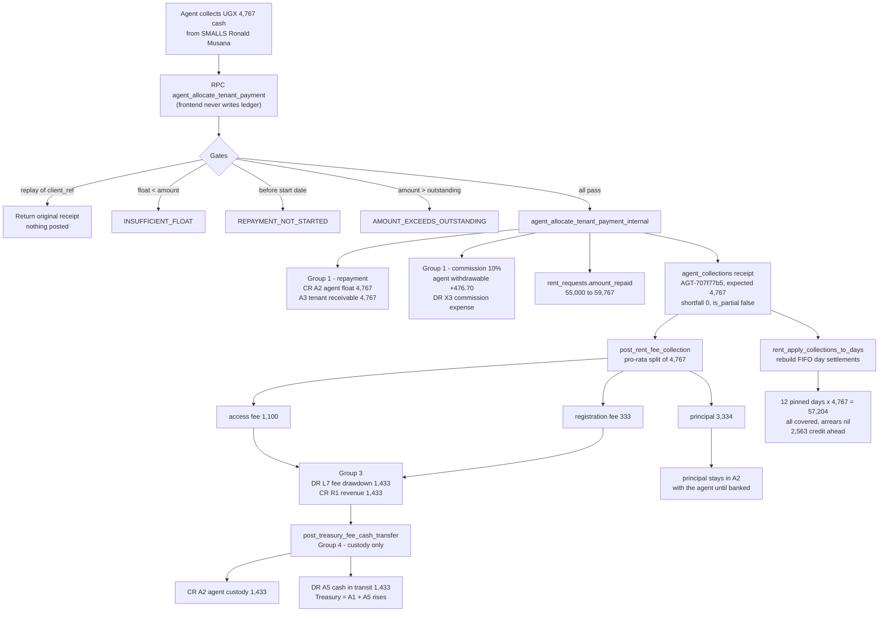

# Rent Collection & Repayment — How the Money Actually Moves

Case study: tenant **SMALLS Ronald Musana**, Rent Plan `7a02c339-2538-42cf-9ef2-2f1950dfde18`,
the **UGX 4,767** instalment collected on **21 Sep 2026 at 06:09 UTC (09:09 Kampala)**.

Every figure below was read from the live database on 21 Sep 2026. No code, ledger row or
migration was changed in producing this document.

---

## 1. The plan being repaid

| Item | Value |
|---|---|
| Tenant | SMALLS Ronald Musana (`ed8512f0…`), phone +256700534334 |
| Agent (collector, guarantor) | `0b109aad…` |
| Landlord | DEMO (`4e2cb564…`), phone 0701355245 |
| Rent released | UGX 100,000 |
| Access fee | UGX 33,000 (= rent × (1.33^(30/30) − 1)) |
| Registration fee | UGX 10,000 (rent ≤ 200,000) |
| **Total repayable** | **UGX 143,000** |
| Term | 30 days, daily |
| Daily instalment | UGX 4,767 (= ceil(143,000 / 30)) |
| Funded | 2026-09-08 07:05 (self-managed partner portfolio `PSF-64FB7A8B`) |
| Repayment starts | 2026-09-09 |
| Status today | `repaying`, `amount_repaid` = 59,767 |

Pricing is not negotiable at the app layer: `compute_rent_repayment()` plus the
`trg_enforce_rent_request_formula` trigger overwrite the four fee fields on every insert/update.

### Payments received so far

| Date (UTC) | Amount | Agent float before → after | Collection id |
|---|---|---|---|
| 2026-09-08 08:55 | 50,000 | 255,300 → 205,300 | `c954d519…` |
| 2026-09-08 13:05 | 5,000 | 205,300 → 200,300 | `a8b53be3…` |
| **2026-09-21 06:09** | **4,767** | **177,300 → 172,533** | `46b3a4ab…` |

Total collected 59,767 of 143,000 → outstanding **83,233**.

---

## 2. The account codes (A1, A2, A3, A5, L5, L7, R1, X3 …)

These are the codes in `ledger_account_catalog`. Every ledger leg is mapped to one of them by
`ledger_account_map` (keyed on scope + category + wallet bucket), and the balance sheet is built
by the single resolver `sofp_ledger_legs(as_at)`.

| Code | Label | Nature |
|---|---|---|
| A1 | Cash and Bank Balances | asset |
| A2 | Cash at Hand — Float with Agents | asset |
| A3 | Rent Access Receivables (Tenants) | asset |
| A4 | Advances and Other Receivables | asset |
| A5 | **Cash in Transit — Received, Not Yet Banked** | asset |
| A6 / A7 | Landlord / Partner Product Receivables | asset |
| A8 | Agent and Merchant Float Cycle Control | asset |
| A9 | Suspense — unresolved postings | asset |
| L1 | Wallet Custody Payable (user balances) | liability |
| L4 | Landlord Rent Payable | liability |
| L5 | Agent Commission Payable | liability |
| L7 | **Platform Treasury Control — Landlord Flow** (deferred fee revenue) | liability |
| R1 | Platform Revenue | revenue |
| X3 | Agent Commission Expense | expense |
| X4 / X5 / X6 | Credit losses / agent-fronted reimbursements / float restatements | expense |
| E1–E4 | Capital and legacy opening-balance equity | equity |

Two derived totals matter operationally:

- **Total company cash = A1 + A2 + A5.**
- **Treasury cash = A1 + A5** (read via `get_treasury_cash_position`). A2 is cash physically
  held by agents, so it is cash but not yet Treasury's.

---

## 3. What happened when the UGX 4,767 was collected

The agent tapped "collect" and the app called one RPC — `agent_allocate_tenant_payment`.
The frontend never writes wallets or the ledger. That RPC produced **four** ledger transaction
groups plus one allocation row. All of it is one database transaction.

### 3.1 Gates checked before any money moved

1. Caller is the agent themself and holds an agent role.
2. `client_ref` (`12152c72…`) advisory-locked and looked up — a replay returns the original
   receipt and posts nothing (`idempotent: true`).
3. Tenant belongs to this agent (or to a verified sub-agent).
4. Repayment has started (`repayment_starts_on` 2026-09-09 ≤ today).
5. Agent float ≥ amount, from `get_user_wallet_view` (`INSUFFICIENT_FLOAT` otherwise).
6. Amount ≤ outstanding (`AMOUNT_EXCEEDS_OUTSTANDING` otherwise).
7. **The landlord-paid gate no longer applies** (removed 21 Sep 2026). Repayments are accepted
   even while the landlord float released to the agent has not reached the landlord. Landlord
   settlement is tracked separately in `agent_landlord_float_allocations` — for this plan that
   earmark was cancelled on 18 Sep 2026 because the partner portfolio had already funded the
   landlord, so no second payout is requested.

### 3.2 Group 1 — the repayment itself (`cbd54eb4…`)

| Leg | Scope | Direction | Amount | Mapped |
|---|---|---|---|---|
| `agent_float_used_for_rent` (agent wallet, bucket `float`) | wallet | cash_out | 4,767 | A2 |
| `tenant_repayment_collected` (tenant, linked to landlord) | platform | cash_in | 4,767 | A3 |

Economically: the cash the agent was holding on the company's behalf is spent settling this
tenant's rent, and the tenant's receivable falls by 4,767. The agent's **float** bucket drops —
never their withdrawable balance. The float is company money and is never withdrawable.

> Reporting note: `tenant_repayment_collected` is mapped `debit_when = cash_in` on A3, and the
> resolver applies workflow overrides R6/R7 so the paired float leg is treated as cash received.
> The direction of the A3 presentation for collection-sourced legs is the open item documented in
> the Family 1 investigation; it is a **reporting-layer** question and changes no ledger row.

### 3.3 Group 2 — agent commission (same group, `cbd54eb4…`)

| Leg | Scope | Direction | Amount | Mapped |
|---|---|---|---|---|
| `agent_commission_earned` (agent wallet, bucket `withdrawable`, `recipient_type: user`) | wallet | cash_in | 476.70 | L1 custody |
| `agent_commission_payable` | platform | cash_out | 476.70 | X3 |

The rate is never hard-coded in the collection path: `get_agent_commission_rate(agent)` is the
single source of truth and the same function feeds the number the agent sees *before* collecting.
Here: 10% of 4,767 = 476.70, no recruiter. For a sub-agent the group also carries a
`agent_commission_earned` leg for the recruiting agent (the 2% override), and the recruiter takes
the **residual** of the rounded total so the group still balances to the cent.

Commission lands in **withdrawable** immediately — it is the agent's own earnings, paid out of
company funds, and is completely separate from float.

### 3.4 Group 3 — fee allocation / instalment waterfall (`f27fa4e3…`)

`post_rent_fee_collection` decomposes the instalment. This plan is in scope
(`is_treasury_waterfall_scope` — funded on/after 2026-09-08 with fees > 0), and a funding-side
`treasury_fee_recognised` leg exists, so allocation ran.

Pro-rata split of 4,767 against the plan weights (100,000 / 33,000 / 10,000 of 143,000), with
largest-remainder rounding and a hard invariant that the parts foot exactly:

| Component | Amount | Meaning |
|---|---|---|
| Principal | 3,334 | landlord float coming back |
| Access fee | 1,100 | platform revenue |
| Registration fee | 333 | platform revenue |
| **Total** | **4,767** | |

Stored in `instalment_allocations` (instalment `943d6453…`). Ledger legs:

| Leg | Direction | Amount | Mapped |
|---|---|---|---|
| `treasury_fee_drawdown` | cash_out | 1,433 | DR L7 (deferred fee liability relieved) |
| `registration_fee_collected` | cash_in | 333 | CR R1 |
| `access_fee_collected` | cash_in | 1,100 | CR R1 |

So of the 4,767, exactly **1,433 became recognised revenue** and **3,334 was capital returning**.

### 3.5 Group 4 — Treasury cash custody transfer (`f3378721…`, ref `RENTFEE-46b3a4ab`)

`post_treasury_fee_cash_transfer` moves the fee portion of the cash out of the agent's custody
into the Platform Treasury pool. It is a **custody movement only** — no fee is recalculated, no
revenue is created; the amount is read from the allocation components.

| Leg | Direction | Amount | Mapped |
|---|---|---|---|
| `agent_float_cash_offset` | cash_out | 1,433 | CR A2 |
| `cash_receipt_in_transit` | cash_in | 1,433 | DR A5 |

Treasury cash (A1 + A5) rises by 1,433; total cash (A1 + A2 + A5) is unchanged. The 3,334 of
principal stays in A2 with the agent until it is banked or redeployed.

### 3.6 After the postings

- `rent_requests.amount_repaid` 55,000 → 59,767, status stays `repaying` (it flips to
  `completed` only when repaid ≥ 143,000). The RPC re-reads the row and aborts the whole
  collection if the update did not land.
- `agent_collections` receipt inserted: tracking `AGT-707f77b5`, `expected_amount` 4,767,
  `shortfall_amount` 0, `is_partial` false, float 177,300 → 172,533.
- `rent_apply_collections_to_days` re-attributes every collection to days (section 5).

---

## 4. Partial payments

`agent_expected_collection(plan)` returns what is due **today**, capped at outstanding:

1. today's pinned instalment from `agent_expected_day_plans` (authoritative);
2. if the day is pinned but this plan has no row → 0 (nothing due today);
3. only if the day was never pinned at all (cron failure) → computed from the schedule.

Then, in `agent_allocate_tenant_payment`:

```
expected   = agent_expected_collection(plan)
shortfall  = max(0, expected − amount)
is_partial = expected > 0 AND amount < expected
```

and those three values are stamped on the receipt, with `partial_reason` required from the agent
when the payment is short.

For SMALLS Ronald Musana all three payments were **not** partial:

| Payment | Expected that day | Paid | Shortfall | `is_partial` |
|---|---|---|---|---|
| 50,000 | 4,767 | 50,000 | 0 | false |
| 5,000 | 4,767 | 5,000 | 0 | false |
| 4,767 | 4,767 | 4,767 | 0 | false |

An overpayment is not "partial" — it simply settles future days (section 5). A partial payment
still posts everything above, just on the smaller amount: smaller float debit, smaller commission,
smaller fee components. Partial status is a **performance** signal for the agent's daily rating,
not an accounting one.

---

## 5. Arrears — how days are settled

Arrears are not stored as a number; they are derived by matching money to days.

- `agent_expected_day_plans` pins one row per plan per day (UGX 4,767 each). This plan is pinned
  from 2026-09-10 to 2026-09-21 — 12 days, 57,204 expected.
- `rent_apply_collections_to_days` deletes and rebuilds `rent_day_settlements` on every
  collection, matching collections to days **FIFO** using running-sum interval overlap, ignoring
  reversed collections and days before `rent_arrears_go_live()`.

Result for this tenant:

| Day | Settled from | Amount |
|---|---|---|
| 10–19 Sep | 50,000 payment | 4,767 × 10 = 47,670 |
| 20 Sep | 50,000 payment (2,330) + 5,000 payment (2,437) | 4,767 |
| 21 Sep | 5,000 payment (2,563) + **4,767 payment (2,204)** | 4,767 |

Applied 57,204 of 57,204 pinned — **every day is fully covered, arrears are nil**, and 2,563 of
the 4,767 collected today sits ahead as credit against tomorrow. This is exactly why FIFO day
attribution is rebuilt each time: a lump sum paid early must protect the tenant's later days
instead of being counted once.

---

## 6. Operational float vs commission vs repayment — the three-bucket rule

| Bucket | What it is | Who owns it | Withdrawable? |
|---|---|---|---|
| `float_balance` | company money placed with the agent to pay landlords and settle tenant rent | the company | **never** |
| `withdrawable_balance` | the agent's own earnings (commission, bonuses, overrides) | the agent | yes, via the pool withdrawal gate |
| `advance_balance` | a liability — advances auto-recovered from incoming earnings | the company | n/a |

Routing is decided by `recipient_type`, not by role: `user` → withdrawable,
`operational_wallet` → float, stamped onto the leg by
`trg_set_wallet_bucket_from_recipient_type`. `apply_wallet_movement` is the only function allowed
to move a wallet bucket, and `enforce_wallet_ledger_only` blocks any other write. Wallet rows are
a cache; `general_ledger` is the truth.

So in one collection: float goes **down** by the full amount, withdrawable goes **up** by the
commission, and the tenant's receivable goes **down** by the full amount.

---

## 7. Flow chart



---

## 8. Balance check on this single instalment

| Account | Movement |
|---|---|
| A2 Cash at Hand — Float with Agents | −4,767 (rent settled) −1,433 (fee cash released) |
| A5 Cash in Transit | +1,433 |
| A3 Rent Access Receivables | −4,767 of obligation settled |
| L7 Treasury Control (deferred fees) | −1,433 (drawn down) |
| R1 Platform Revenue | +1,433 |
| L1 Wallet Custody Payable (agent withdrawable) | +476.70 |
| X3 Agent Commission Expense | +476.70 |

Cash total (A1+A2+A5) falls by 4,767 in the hands of agents and rises by 1,433 in Treasury; the
net 3,334 is principal that remains agent-held cash. Revenue of 1,433 is recognised, commission
of 476.70 is expensed, and the group-balance trigger
(`trg_enforce_ledger_group_balance`) refuses any of it unless cash_in equals cash_out per group.

---

## 9. Failure handling and guarantees

- **Exactly once.** `client_ref` advisory lock plus per-group idempotency keys
  (`rent-fee-collection:…`, `treasury_fee_transfer:…`). A double tap returns the first receipt.
- **Fee posting is non-fatal.** If allocation fails, the payment still stands and the reason is
  filed in `rent_fee_collection_exceptions` (`fee_posting_failed`, or
  `funding_treasury_recognition_missing` when the funding-side Treasury leg is absent) for
  replay. Money is never lost to a reporting failure.
- **Day attribution is non-fatal.** `rent_apply_collections_to_days` failures raise a warning and
  the next collection rebuilds the settlements from scratch.
- **Legacy plans.** Plans funded before 2026-09-08, or with no fees priced, return
  `out_of_scope_legacy`: they post groups 1 and 2 only and are never retro-decomposed.
- **Corrections** are made in the resolver or by new postings — never by editing
  `general_ledger`.

---

## 10. Terminology

Rent Plan (never "loan"), Supporter (never "lender"), Returns (never "interest"/"ROI"),
and all amounts in UGX.
