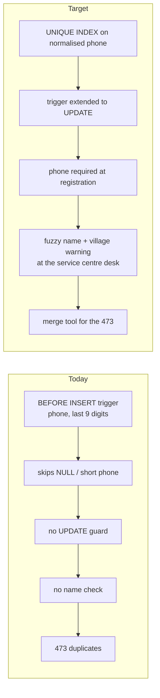
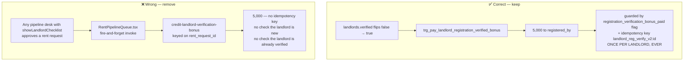
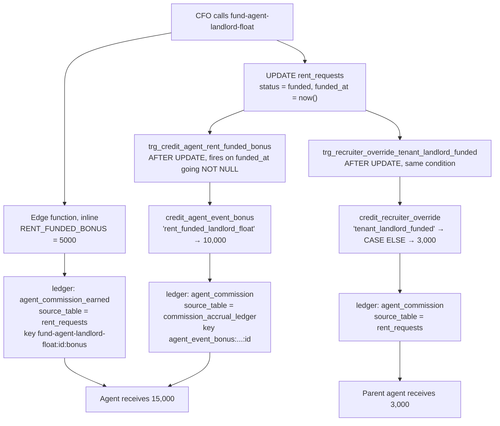
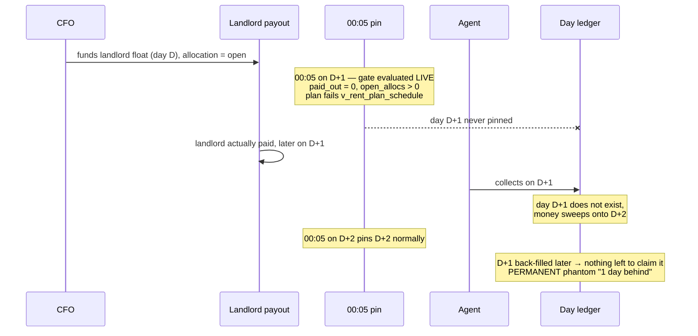

# Commission policy: what was verified, what was decided, and what has to change

**Companion to** [`rent-plan-pipeline-and-commission-map.md`](./rent-plan-pipeline-and-commission-map.md).
That document describes the pipeline as it is. This one records the **decisions
taken on 23 September 2026**, the verification behind each, and the exact change
each one implies.

All figures read from production on **23 September 2026**. No code or schema was
changed in producing this document.

---

## Contents

1. [Decision summary](#1-decision-summary)
2. [Verified: can a landlord be registered twice?](#2-verified-can-a-landlord-be-registered-twice)
3. [Decision — pay for the person, not the paperwork](#3-decision--pay-for-the-person-not-the-paperwork)
4. [Decision — nothing pays at submission or service centre](#4-decision--nothing-pays-at-submission-or-service-centre)
5. [Where the 10,000 and the 3,000 came from](#5-where-the-10000-and-the-3000-came-from)
6. [Why the pin touches previous days](#6-why-the-pin-touches-previous-days)
7. [What the pin does about arrears and weekly plans](#7-what-the-pin-does-about-arrears-and-weekly-plans)
8. [Decisions on findings 2–6](#8-decisions-on-findings-26)
9. [The change list](#9-the-change-list)

---

## 1. Decision summary

| # | Decision | Status today |
|---|---|---|
| A | A landlord or LC1 chairperson already in the system cannot be registered again | **partly enforced — 473 duplicate landlords exist** |
| B | The 5,000 landlord bonus is paid **once per new landlord**, at vetting + verification only — never again in the rent pipeline | **not enforced — 2,270,000 overpaid** |
| C | Same rule for the LC1 chairperson bonus | already once-per-person; pipeline path is dead |
| D | No commission at rent-request submission | true today, but **only because of a typo** |
| E | No commission at service-centre review | true today, no path exists |
| F | The funding bonus is **5,000**, not 15,000 | **10,000 must be removed** |
| G | Keep only `service_centre_setup` and `tenant_placement` from the unused event bonuses | 4 events to delete |
| H | Reversed collections must stop affecting figures, but the rows are kept | 1,226 rows / 98,947,719 still counted |

---

## 2. Verified: can a landlord be registered twice?

**Short answer: they should not be able to, and 473 of them were.**

### What guards exist

| Table | Guard | Fires on | Basis |
|---|---|---|---|
| `landlords` | `enforce_unique_landlord_phone` | **BEFORE INSERT only** | last 9 digits of `phone` |
| `lc1_chairpersons` | `block_duplicate_lc1_phone` | **BEFORE INSERT only** | `normalize_phone(phone)` |

**Neither table has a unique index on phone or name.** The only unique index on
either is the primary key. The guards are trigger-level, and both have three gaps:

1. **INSERT only.** Nothing stops an `UPDATE` from setting a phone that already
   belongs to another landlord.
2. **`enforce_unique_landlord_phone` returns early** when the phone is NULL, blank,
   or fewer than 9 digits. A landlord registered without a phone, then filled in
   later, bypasses the check entirely.
3. **Name is not checked at all.** The same person under a different phone is a
   new landlord as far as the system is concerned.

### What is actually in the table

| | Landlords | LC1 chairpersons |
|---|---:|---:|
| Total rows | **46,328** | **24,475** |
| Verified | 5,074 | 471 |
| Duplicate **phone** groups | **289** | **13** |
| Rows in those groups | 762 | 31 |
| **Extra (duplicate) rows** | **473** | **18** |
| …of which verified | 197 | 26 |
| Duplicate **name** groups (case-insensitive) | **209** | — |
| Extra rows by name | 385 | — |
| …of which verified | 179 | — |

197 verified landlords share a phone number with another verified landlord. Each
verified row is capable of paying a 5,000 bonus, so duplicates are not just a data
problem — they are a payout multiplier.

### What has to change



1. **A real unique index** on `right(regexp_replace(phone,'\D','','g'), 9)` —
   partial, `WHERE length(...) = 9`, so legacy blank-phone rows do not block it.
   A trigger is advisory; an index is a guarantee.
2. **Extend both triggers to `UPDATE`**, not just `INSERT`.
3. **Make phone mandatory** at registration, since the guard is worthless without it.
4. **Name + village near-duplicate warning** at the service-centre desk. The
   `idx_landlords_name_trgm` GIN index already exists for exactly this — it is not
   being used to warn anyone.
5. **The 473 existing duplicates need a merge path**, not a delete: they carry
   rent requests, payouts and bonuses. Until they are merged, the bonus rule in
   §3 should key on the **surviving** landlord id.

> The index cannot be created until the existing duplicates are resolved. Order
> matters: merge first, then constrain.

---

## 3. Decision — pay for the person, not the paperwork

> **The 5,000 is paid once, for bringing a genuinely new landlord into the system,
> at the moment that landlord is vetted and verified. It is never paid again —
> and in particular it is never paid inside the rent-request pipeline.**

### There are two bonus paths today, and only one of them is right



### The cost of the wrong path

Measured over its whole life, **2026-04-10 → 2026-09-22**:

| | Value |
|---|---:|
| Ledger legs written | 1,177 |
| Distinct rent requests | 1,131 |
| **Distinct landlords behind them** | **723** |
| **Paid out** | **5,885,000** |
| Would have been paid at once-per-landlord | 3,615,000 |
| **Overpaid** | **2,270,000** (38.6%) |

Two separate leaks inside that:

- **46 legs against only 1,131 distinct rent requests** — the same rent request
  paid more than once, because the `create_ledger_transaction` call in
  `credit-landlord-verification-bonus` passes **no `idempotency_key` at all**.
  Both call sites in `RentPipelineQueue.tsx` are fire-and-forget, so a retry or a
  second desk approving simply pays again.
- **154 landlords were paid through *both* paths — 770,000 double-paid.** They got
  5,000 when they were verified, and 5,000 again when a rent request naming them
  passed a pipeline desk.

For comparison, the correct path has paid **2,030 landlords, 10,150,000, exactly
once each** — the flag plus the idempotency key have held perfectly.

### The LC1 chairperson side

Already correct, and worth noting the amount is **2,000, not 5,000**:

- `pay_lc1_registration_verified_bonus` pays **2,000** to `registered_by` when
  `verified` flips true, guarded by `registration_verification_bonus_paid` and the
  key `lc1_reg_verify_v1:<id>`. Once per chairperson.
- A separate **3,000 recruiter override** goes to the parent agent on the same
  event (`credit_recruiter_override('lc1_chairperson_verified')`).
- There is a pipeline-flavoured LC1 path (`credit-lc1-verification-bonus`, invoked
  from `GlobalVerificationHub.tsx`) which should be reviewed against the same rule.

### One more dead path worth knowing about

`pay_listed_landlord_verified_bonus` fires when a landlord is verified and loops
over **every** rent request naming that landlord, calling
`credit_agent_event_bonus(agent, 'rent_landlord_verified', …)`.

`credit_agent_event_bonus` does not recognise `'rent_landlord_verified'`, so it
returns an error object, `PERFORM` discards it, and nothing is paid. **Had the key
matched, this trigger would pay one bonus per rent request per landlord** — the
same multiplication the decision above exists to prevent. It should be deleted,
not fixed.

### What has to change

| Change | Where |
|---|---|
| Remove both `credit-landlord-verification-bonus` invocations | `src/components/executive/RentPipelineQueue.tsx` (lines ~680 and ~1098) |
| Retire the edge function itself | `supabase/functions/credit-landlord-verification-bonus/` |
| Drop the dead per-rent-request trigger | `trg_pay_listed_landlord_verified_bonus` + its function |
| Add the same `new landlord` test to the surviving path | `pay_landlord_registration_verified_bonus` — skip when the landlord resolves to an existing verified duplicate |
| Review the LC1 pipeline path against the same rule | `credit-lc1-verification-bonus`, `GlobalVerificationHub.tsx` |

Keep the `recordLandlordApprovalAudit` call — the audit trail of who approved what
is still wanted. Only the payout goes.

---

## 4. Decision — nothing pays at submission or service centre

> **Posting a rent request earns nothing. Passing service-centre review earns
> nothing. Earning starts when the CFO funds the landlord.**

### This is already true — but for the wrong reason

**Service centre: genuinely nothing exists.** No bonus path is wired to
`service_center_review` at all, and `approve-rent-request` says so in as many words:

```ts
// No approval-time bonus is paid here anymore.
...
agent_bonus_paid: 0,
```

**Submission: a 5,000 bonus is wired, and it is held back by a typo.**
`trg_pay_listed_rent_posted_bonus` fires on every rent request that carries a
house listing and calls:

```sql
PERFORM public.credit_agent_event_bonus(NEW.agent_id, 'rent_posted_listed', ...);
```

`credit_agent_event_bonus` only knows `'rent_request_posted'`. The unmatched key
makes the amount NULL, the function returns
`{"status":"error","message":"Unknown event_type: rent_posted_listed"}`, and
`PERFORM` throws the result away. `commission_accrual_ledger` has **never**
contained a `rent_request_posted` row.

**That is the whole enforcement.** One word. Anybody tidying up "why does this
event key not match the function" would switch on a 5,000 payout per posted rent
request without realising they had changed policy.

### What has to change

Delete the trigger and the function — do not leave a disabled bonus lying around
where a future fix can revive it:

- drop `trg_pay_listed_rent_posted_bonus` and `pay_listed_rent_posted_bonus`
- drop the `'rent_request_posted'` branch from `credit_agent_event_bonus` (see §8)
- add a line to the pipeline document stating the rule, so the absence is
  deliberate rather than accidental

---

## 5. Where the 10,000 and the 3,000 came from

You are right that production "knows 5,000" — the constant is right there:

```ts
const RENT_FUNDED_BONUS = 5000 // UGX 5,000 flat bonus
```

The other two payments come from somewhere else entirely.



### The 10,000 — a second bonus engine that was never reconciled with the first

Around **28–30 July 2026** a general event-bonus engine was introduced:
`commission_accrual_ledger` plus `credit_agent_event_bonus`, with a fixed price
list of eight event types. `rent_funded_landlord_float` was given **10,000** in
that list, and `trg_credit_agent_rent_funded_bonus` was attached to
`rent_requests` to fire it.

The edge function's own 5,000 was never removed. So since late July the two have
run side by side:

- different **amounts** — 5,000 vs 10,000
- different **ledger categories** — `agent_commission_earned` vs `agent_commission`
- different **source tables** — `rent_requests` vs `commission_accrual_ledger`
- different **idempotency namespaces**, so neither can see the other

Each is individually correct and individually idempotent. Nothing is retrying or
double-firing. **The agent simply gets both.** They never appear together in one
report because nothing groups across those two categories.

`commission_accrual_ledger` shows the 10,000 path has run **1,404 times since
2026-07-28, totalling 14,040,000**.

### The 3,000 — nobody chose it

`credit_recruiter_override` prices the override with this CASE:

```sql
v_amount := CASE p_event_type
  WHEN 'house_listed_verified' THEN 2000
  ELSE 3000
END;
```

`tenant_landlord_funded` is not named. **3,000 is the fallback branch** — the
value an unrecognised event gets. The same 3,000 is therefore also paid for
`landlord_verified` and `lc1_chairperson_verified`. It was never a decision about
rent funding; it is a default that rent funding happened to fall into.

> **A second landmine here.** There are **two** functions named
> `credit_recruiter_override` in production with different signatures and
> different logic — one keyed on `agent_subagents.subagent_id` with
> `status = 'active'` paying 2,000/3,000, the other on `sub_agent_id` with
> `status = 'verified'`. The trigger reaches the second. Overloads that differ in
> *business rules* rather than just types will eventually be called wrongly. One
> should be dropped.

### The decision

**5,000 at funding, from one code path.** The 10,000 goes (§8, finding 3).

The 3,000 override should be decided explicitly rather than inherited from an
`ELSE` — either name `tenant_landlord_funded` in the CASE with a chosen figure,
or drop the override at funding. Until that is decided, it keeps paying 3,000
because of a default nobody selected.

---

## 6. Why the pin touches previous days

Your instinct is right: **the pin's job is to write today's expected amount, and
nothing else.** `pin_agent_expected_day(day)` writes exactly one row per plan per
scheduled day and refuses any day in the future.

The trailing window is not part of the design. It is a **repair for a bug that the
next-day rule does not cover** — and the bug is the landlord-payout gate from
Finding 1.

### The failure it exists to repair



This was confirmed on two live plans — **Faizal Kayondo and Hamiss Mutyaba, both
under agent Shakirah Nakimbugwe** — each showing arrears exactly equal to their
first day's rent while having paid every billed day in full and on time.

The fix shipped on **17 September 2026** as
`20260917120000_fix_arrears_day1_pin_gap.sql` and has two parts:

1. `pin_agent_expected_day_for_plan(plan)` — a per-plan catch-up that back-fills
   any day from `term_start` to today that the gate **now** allows but did not
   before. Idempotent, scoped to one plan.
2. `rent_apply_collections_to_days(plan)` now runs that catch-up first, then
   **fully re-derives** the plan's settlements from all its collections against
   all its pinned days — delete and rebuild — instead of only moving still-unapplied
   money. That is what lets a late day-1 pull money back off whichever later day
   absorbed it.

`pin_agent_expected_day_catchup(6)` is the nightly backstop for plans that never
receive another collection to trigger part 2.

### So, to answer directly

- **The pin does not decide to bill old days.** It writes today.
- **The trailing 6 days are a retry**, because the gate that decides whether a
  plan is billable is evaluated at 00:05 and can change afterwards.
- **The next-day rule is not what is failing.** A plan funded today correctly
  starts on the day after. What failed is that the *first* day was sometimes not
  written at all, because the landlord had not been paid yet at 00:05.

**Fix the landlord-payout gate (Finding 1) and the catch-up window becomes
unnecessary.** The right end state is: a plan becomes billable on a known date, the
pin writes that day once, and there is nothing to retry. The 6-day window is a
symptom.

Until then it must stay, and anything that alerts an agent on "days behind" should
suppress days whose `captured_at` is later than the day itself — otherwise agents
are told they are behind on days they were never shown.

---

## 7. What the pin does about arrears and weekly plans

### Arrears are never pinned

This is the part worth being precise about, because the two are easy to merge.

| | Where it lives | How it is computed |
|---|---|---|
| **Expected today** | `agent_expected_day_plans.expected_ugx` | pinned once at 00:05, immutable |
| **Arrears** | nowhere — **derived** | `v_rent_day_ledger`: per day, `expected − settled`; `v_rent_plan_arrears` rolls that up, excluding today |

**Nothing is ever added to a pinned row.** An expectation, once written, reads the
same forever — that is the property that makes historical reporting trustworthy.
A missed day stays on the books as its own row with `settled < expected`, and the
arrears total is the sum of those gaps. The bill is not re-priced; the shortfall
is simply still sitting there, unsettled.

So a tenant three days behind does not have a bigger number pinned for today. They
have **four open rows** — three old ones partly or wholly unsettled, and today's at
its normal amount. Collected money then clears the oldest first
(`rent_apply_collections_to_days`, FIFO).

That is the same conclusion reached in
[`arrears-carry-forward-settlement-order.md`](./arrears-carry-forward-settlement-order.md) §1:
the shortfall is a pending balance, not a daily charge.

### Weekly plans

Handled in `rent_plan_schedule_days`, which is what the pin reads:

```sql
step        = 7            -- weekly
instalment  = daily_amount * 7
due_on      = term_start + (k * 7)
```

One row is emitted **on the due day only**, for the **whole week's amount**. On the
other six days a weekly plan produces no row at all, so:

- it is absent from the daily target on non-due days, and
- on its due day it appears at the full weekly instalment, not one seventh.

The last instalment is clamped with `least(instalment * (k+1), total_amount)` so a
term that does not divide evenly by 7 cannot over-bill.

Monthly plans work the same way with a one-month step and a ×30 instalment.

---

## 8. Decisions on findings 2–6

### Finding 2 — remove the unused event bonuses; keep two

Four event types have existed since late July and have **never** paid once.
Decision: **delete all but `service_centre_setup` and `tenant_placement`.**

| Event type | Amount | Rows ever | Decision |
|---|---:|---:|---|
| `rent_request_posted` | 5,000 | 0 | **delete** — contradicts §4 |
| `tenant_replacement` | 20,000 | 0 | **delete** |
| `service_centre_setup` | 25,000 | 0 | **keep**, and wire it |
| `tenant_placement` | 10,000 | 0 | **keep**, and wire it |
| `house_listed` | 2,000 | 2,003 | keep — live |
| `subagent_registration` | 10,000 | 2,511 | keep — live |
| `rent_funded_landlord_float` | 10,000 | 1,404 | **delete** — see finding 3 |
| `three_verified_houses` | 10,000 | 1 | keep |

The two kept events are **defined but not connected to anything**. Keeping them in
the price list without wiring them leaves the same trap as `rent_posted_listed`:
a value that looks live and is not. Either wire them to a real event or mark them
explicitly as not yet in service.

`pay_tenant_placement_bonus` exists as a trigger on `house_listings` — worth
checking whether it is another mismatched key before writing a new one.

### Finding 3 — the funding bonus is 5,000

**Decision: keep the 5,000 in `fund-agent-landlord-float`. Remove the 10,000.**

Remove `trg_credit_agent_rent_funded_bonus` and the
`'rent_funded_landlord_float'` branch of `credit_agent_event_bonus`. The edge
function's payment is the one to keep: it is closest to the event, carries a clear
idempotency key, and matches the documented figure.

Effect: agent earnings per funded plan fall **15,000 → 5,000**. On September's 275
funded plans that is 4,125,000 → 1,375,000.

**Historical payments stay.** They were paid in good faith under rules the system
actually applied; clawing back 14,040,000 across 1,404 fundings since July would
be both unfair and operationally impossible. The change is forward-only, and the
agents should be told before it lands.

### Finding 4 — neutralise reversals in the figures, keep the rows

| | Rows | UGX |
|---|---:|---:|
| Marked `[REVERSED:` in `notes` | **1,226** | **98,947,719** |
| `reversed_at` set, no marker | 48 | 1,417,000 |
| All receipts, all time | 15,239 | 484,694,314 |

Reversed receipts are **20.4% of all recorded collection value** and every
`SUM(amount)` tile counts them.

**Decision: the rows are kept for reference; they stop affecting the figures.**

The right mechanism is **not** `DELETE`. Deleting would break the ledger legs and
the settlement rows that point at those receipts, and would destroy exactly the
reference trail the decision asks to keep. Instead:

1. **One canonical predicate.** Add a generated or maintained
   `is_reversed boolean` on `agent_collections`, true when either the `notes`
   marker or `reversed_at` is present. Two representations exist today and only
   the marker is watched.
2. **A clean view** — `v_agent_collections_effective` — filtered to
   `NOT is_reversed`. Every tile, report and RPC reads the view; nothing reads the
   table directly for money figures.
3. **Backfill the 48 unmarked rows** so both representations agree. Right now
   **46 settlement rows are still held by those 48 reversed receipts**, meaning 46
   days read as settled against money that was reversed.
4. **Make `trg_rent_drop_settlements_on_reversal` watch `reversed_at` too**, not
   just the notes marker.

The historical figures will move when this lands. That restatement should be
announced, not discovered.

### Finding 5 — what was being saved to `agent_earnings`

**Cause found.** The table's columns are:

```
id, agent_id, amount, earning_type, source_user_id, rent_request_id,
description, created_at
```

There is **no `currency` column**. Four writers send one anyway:

| Writer | Sends `currency` |
|---|---|
| `fund-agent-landlord-float` | yes |
| `credit-landlord-verification-bonus` | yes |
| `disburse-rent-to-landlord` | yes |
| `approve-listing-bonus` | yes |

Every one of those inserts fails with *column "currency" does not exist*. None of
them captures the error — each is a bare `await …insert({...})` with no
destructured `error` — so the failure is invisible. In all four files the
`currency: 'UGX',` line sits at a different indentation from its neighbours, which
is the signature of a bulk edit that added the field to every payload at once.

That matches the data exactly: the last `rent_funded_bonus` row is **2026-04-01**
and the last `verification_bonus` row is **2026-04-07**. The table has been
accepting nothing from these paths for nearly six months. `product-purchase`, which
does **not** send `currency`, still writes fine.

**What was meant to be saved:** a human-readable earnings feed for the agent — one
row per bonus with the type, the amount, the rent request and a description. The
money itself was never at risk; it goes through `create_ledger_transaction` and
landed correctly every time.

**Decision needed:** either drop the `currency` key from the four payloads and
resume writing, or retire `agent_earnings` and have the agent-facing feed read the
ledger directly. The second is cleaner — the ledger is already the source of truth
and `commission_accrual_ledger` covers the event bonuses. What must not continue is
a table that looks like an earnings history, is five months stale, and is still
being written to by code that believes it is working.

### Finding 6 — see §6 and §7

The pin does what you expected. The trailing window is a repair for the
landlord-payout gate, not a design choice, and it should disappear when that gate
is fixed.

---

## 9. The change list

Ordered by what unblocks what. Nothing here has been applied.

### Immediate — stop the leaks

| # | Change | Effect |
|---|---|---|
| 1 | Remove both `credit-landlord-verification-bonus` invocations from `RentPipelineQueue.tsx`; retire the edge function | stops ~5,000 per pipeline approval; the correct per-landlord path continues |
| 2 | Drop `trg_pay_listed_landlord_verified_bonus` + function | removes a dormant per-rent-request multiplier |
| 3 | Drop `trg_credit_agent_rent_funded_bonus`; remove `'rent_funded_landlord_float'` from `credit_agent_event_bonus` | funding bonus 15,000 → 5,000 |
| 4 | Drop `trg_pay_listed_rent_posted_bonus` + function; remove `'rent_request_posted'` | makes "nothing at submission" a rule, not a typo |
| 5 | Remove `'tenant_replacement'` from the price list | unused |

### Next — data integrity

| # | Change | Effect |
|---|---|---|
| 6 | Add `is_reversed` to `agent_collections`; backfill the 48 unmarked rows; extend `trg_rent_drop_settlements_on_reversal` to `reversed_at` | releases 46 wrongly-held settlement days |
| 7 | Create `v_agent_collections_effective`; repoint every money figure at it | removes 98,947,719 of reversed value from the tiles |
| 8 | Merge the 473 duplicate landlords and 18 duplicate LC1 rows | prerequisite for #9 |
| 9 | Unique partial index on normalised landlord phone; extend both dedupe triggers to `UPDATE`; make phone mandatory | makes "cannot register twice" true |
| 10 | Near-duplicate name/village warning at the service-centre desk using `idx_landlords_name_trgm` | catches the 209 name duplicates the phone index cannot |

### Then — the structural ones

| # | Change | Effect |
|---|---|---|
| 11 | Surface the 25 gate-blocked plans and alarm on failed landlord payouts (Finding 1 — the gate itself is correct, see its correction note) | agents stop losing tenants silently |
| 12 | Retire the 6-day pin catch-up once #11 holds | the pin writes today, and only today |
| 13 | Decide the recruiter override at funding explicitly, or drop it | 3,000 stops being an `ELSE` default |
| 14 | Drop one of the two `credit_recruiter_override` overloads | removes a real call-the-wrong-one risk |
| 15 | Decide `agent_earnings`: fix the payloads or retire the table | ends a five-month silent failure |
| 16 | Wire `service_centre_setup` and `tenant_placement`, or mark them not-in-service | no more prices that look live and are not |

---

## Terminology

Rent Plan (never "loan"), Supporter (never "lender"), Returns (never "interest" or
"ROI"). All amounts UGX.
