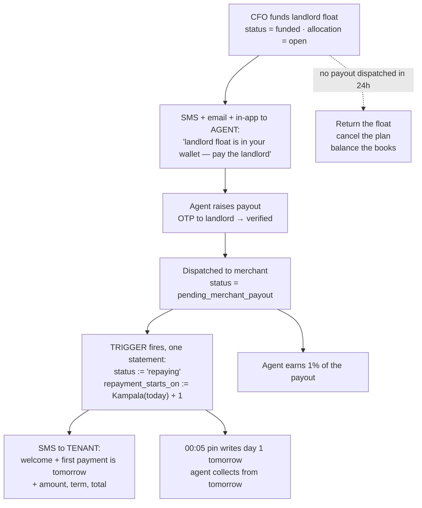

# Implementation spec — the repaying gate, the commission map, and the 24-hour return

**Final decisions from 23 September 2026.** This supersedes the proposals in
[`repaying-gate-and-bonus-redesign-2026-09-23.md`](./repaying-gate-and-bonus-redesign-2026-09-23.md)
wherever the two disagree. Background:
[`rent-plan-pipeline-and-commission-map.md`](./rent-plan-pipeline-and-commission-map.md),
[`commission-policy-decisions-2026-09-23.md`](./commission-policy-decisions-2026-09-23.md).

Nothing here has been applied. Verified against production 23 September 2026.

---

## Contents

1. [One reading to confirm](#1-one-reading-to-confirm)
2. [The final commission map](#2-the-final-commission-map)
3. [The repaying gate](#3-the-repaying-gate)
4. [Answering your `pending_merchant_payout` question](#4-answering-your-pending_merchant_payout-question)
5. [The tenant welcome SMS](#5-the-tenant-welcome-sms)
6. [The 24-hour return](#6-the-24-hour-return)
7. [What gets retired](#7-what-gets-retired)
8. [Build order and acceptance tests](#8-build-order-and-acceptance-tests)

---

## 1. One reading to confirm

> "landlord verification will remain as 5,000 not 2,000 for the agent, parent gets
> nothing. **also i think we can drop the 5,000 for that in the landlord and use
> the 1% commission instead**"

I have read the second sentence as: **drop the flat 5,000 that was going to move to
the landlord-payout moment, and let the existing 1% payout commission stand alone
there.** The landlord *verification* bonus stays at 5,000 as stated in the first
sentence.

That is the only reading consistent with both sentences, and it answers the point
I raised — two payments firing at the same instant from two functions. One
percentage, one function, one ledger group.

**If you meant something else, say so before Phase 1 is built.** Everything in §2
depends on it.

What it means in money, on the three rent sizes we see most:

| Rent funded | Old flat bonus | New: 1% of payout | Difference |
|---:|---:|---:|---:|
| 250,000 | 5,000 | **2,500** | −2,500 |
| 400,000 | 5,000 | **4,000** | −1,000 |
| 450,000 | 5,000 | **4,500** | −500 |
| 1,000,000 | 5,000 | **10,000** | +5,000 |

The break-even is 500,000. Below it the agent earns less than the flat bonus, above
it more. That is the right direction — a bigger payout is a bigger errand and a
bigger risk — but agents working small rents will see a cut, on top of the
acquisition changes. Worth saying out loud before it lands.

---

## 2. The final commission map

Every earning event after this work, with what changes.

| Stage | Who | Amount | Change |
|---|---|---:|---|
| House listed + verified | agent | 2,000 | unchanged |
| House listed + verified | parent | 2,000 | unchanged |
| **Landlord verified (new landlord only)** | **agent** | **5,000** | **unchanged in amount; paid once per landlord, never per rent request** |
| **Landlord verified** | **parent** | **0** | **was 3,000 — removed** |
| **LC1 verified (new LC1 only)** | agent | 2,000 | unchanged |
| **LC1 verified** | **parent** | **0** | **was 3,000 — removed** |
| Sub-agent registered | recruiter | 10,000 | unchanged |
| **Rent request posted** | agent | **0** | **enforced, not left to a typo** |
| Service centre review | anyone | 0 | unchanged |
| Six approval desks | anyone | 0 | unchanged |
| **CFO funds landlord float** | **agent** | **0** | **was 5,000 + 10,000 — both removed** |
| **CFO funds landlord float** | **parent** | **0** | **was 3,000 — removed** |
| **Landlord float leaves the agent wallet** | **agent** | **1% of the payout** | **sole payment at this event** |
| Each collection | agent | 10% (8% if sub-agent) | unchanged |
| Each collection | parent | 2% | unchanged |

### The worked example, before and after

250,000 rent, 30 days, new landlord, ordinary agent:

| | Before | After |
|---|---:|---:|
| Listing verified | 2,000 | 2,000 |
| Landlord verified | 5,000 | 5,000 |
| Rent request posted | 0 | 0 |
| Approval desks | 0 | 0 |
| **CFO funds float** | **15,000** | **0** |
| **Landlord actually paid** | 2,500 | **2,500** |
| 30 collections × 10% | 35,250 | 35,250 |
| **Total** | **59,750** | **44,750** |
| **Paid before any collection** | **24,500 (41%)** | **9,500 (21%)** |

The shift is deliberate: **acquisition pay halves, and what remains is paid for
work completed rather than money received.** The collection commission is
untouched, so an agent who actually collects is barely affected.

### What each removal is worth, measured

| Stream removed | Payments to date | UGX | Running since |
|---|---:|---:|---|
| Event bonus 10,000 at funding | 1,404 | **14,040,000** | 2026-07-28 |
| Parent override, landlord verified | 2,473 | **7,405,000** | 2026-06-17 |
| Pipeline landlord bonus, per rent request | 1,177 | **5,885,000** | 2026-04-10 |
| Flat 5,000 at funding | 275 (Sept alone) | 1,375,000 (Sept) | long-standing |
| Parent override, tenant/landlord funded | 390 | 1,170,000 | 2026-06-16 |
| Parent override, LC1 verified | 15 | 45,000 | 2026-06-15 |

**Historical payments are not clawed back.** They were paid under rules the system
actually applied. All changes are forward-only.

### "Landlords are paid for only if they are new" — how that is guaranteed

The surviving path, `pay_landlord_registration_verified_bonus`, already enforces
it three ways:

1. it fires only on the `verified` transition `false → true`, so an
   already-verified landlord can never trigger it again;
2. it checks `registration_verification_bonus_paid = false` before paying and sets
   the flag after;
3. its ledger call carries `idempotency_key = 'landlord_reg_verify_v2:' || id`.

**No change needed to that function.** What closes the gap is deleting the two
paths that pay per *rent request* rather than per *landlord*:

- `pay_listed_landlord_verified_bonus` — the trigger you quoted, with the
  per-rent-request loop
- `credit-landlord-verification-bonus` — the edge function invoked from
  `RentPipelineQueue.tsx`, keyed on `rent_request_id`, with no idempotency key at
  all

After those two are gone, **one new landlord = one 5,000, ever.** And
`credit_agent_event_bonus` has no involvement in the landlord process at all.

---

## 3. The repaying gate

### The rule

> A Rent Plan becomes `repaying` when the landlord float **leaves the agent's
> wallet** — the moment the payout is dispatched to a merchant agent, after the
> landlord has entered the OTP sent to their phone. The tenant's first repayment
> day is **the day after that**.



### The two fields, set together

This is the part that must not be got wrong.

```
status              := 'repaying'
repayment_starts_on := (now() AT TIME ZONE 'Africa/Kampala')::date + 1
```

`repayment_starts_on` is currently stamped at **funding + 1** by
`rent_request_default_repayment_start`. If a plan is funded on Monday and the
landlord is paid on Thursday, leaving the old value in place would have the pin
bill Tuesday, Wednesday and Thursday — **three days the agent could never have
collected, written permanently into an immutable bill.**

That is exactly the failure that produced the phantom day-1 arrears on Faizal
Kayondo and Hamiss Mutyaba. Re-stamping the date is what stops it recurring at the
scale of every funded plan.

### Where the trigger goes

An `AFTER UPDATE` trigger on `landlord_payouts`, firing when `status` becomes
`pending_merchant_payout`, alongside the existing
`trg_post_landlord_payout_finops_commission`. It must:

- resolve `rent_request_id` (directly, or via `tenant_id` as
  `apply_landlord_payout_to_allocation` already does);
- act only when the plan is currently `funded` — never re-stamp a plan already
  `repaying`, or the date would move every time another payout is raised;
- be idempotent, and non-fatal, so a failure here can never block a payout.

### What this makes true

| | Before | After |
|---|---|---|
| "Is this plan collectable?" | inferred from a three-way join on payout evidence, re-evaluated live at 00:05 | **one column: `status = 'repaying'`** |
| First billable day | funding + 1, whether or not the landlord was paid | the day after the landlord was actually paid |
| Day-1 pin gap | repaired by a 6-day catch-up | **cannot occur** |
| 25 plans invisible with no explanation | silent | they are `funded`, a real and visible state |

---

## 4. Answering your `pending_merchant_payout` question

> "we can base on `pending_merchant_payout`, it will work cause the money is now
> no longer in the agent wallet, it has left. right?"

**Operationally yes. In the books, not quite yet — and the difference is worth
knowing before you rely on it.**

Here is what is and is not true at `pending_merchant_payout`:

| | At `pending_merchant_payout` |
|---|---|
| Agent's **spendable** landlord float | **reduced** — `get_agent_lp_float_available` subtracts every payout in `otp_verified` or `pending_merchant_payout` |
| Can the agent use that money for anything else? | **No** |
| `agent_landlord_float.balance` | **unchanged** |
| `allocation.paid_out_amount` | **still 0**, allocation still `open` |
| Has the landlord received the money? | **No** — a merchant still has to pay out |

So: **the agent's discretion over the money ends at `pending_merchant_payout`**,
which is the thing your rule actually cares about. The accounting catches up a
little later, when the payout reaches `pending_finops_disbursement` /
`awaiting_agent_receipt` and `apply_landlord_payout_to_allocation` bumps
`paid_out_amount`.

**Using `pending_merchant_payout` is the right call**, for a reason your own next
point supplies: because repayment starts *tomorrow*, a same-day merchant failure
costs nothing. The plan flips to `repaying` today, the agent retries today, and no
collection has happened yet either way. The next-day rule is the grace window.

**The one case to handle.** If a merchant payout fails **after** repayment has
started — on day 2 or later — `refund_agent_float_for_payout` returns the money to
the agent's float and marks the payout `failed`, but the plan is already
`repaying` and the tenant may already have paid. Do **not** auto-revert to
`funded`: collections have happened and reversing the status would orphan them.
Instead:

- raise an alert to FinOps and Landlord Ops naming the plan, the landlord and the
  amount;
- require a re-dispatch of the payout against the same allocation;
- leave `status` and `repayment_starts_on` alone.

For scale: **107 payouts are currently `failed`, worth 74,700,000.** This will
happen.

---

## 5. The tenant welcome SMS

Fires from the same transition as §3 — one SMS, once, when the plan becomes
`repaying`.

**Content:** a welcome to Welile, the date repayment starts (tomorrow), the daily
or weekly amount, the term, and the total repayable. An onboarding confirmation,
not a demand.

```
Welcome to Welile, {tenant_first_name}. Your rent of UGX {rent_amount} has been
paid to your landlord {landlord_name}.

Your repayment starts TOMORROW, {date}:
  UGX {instalment} {per day|per week}
  for {duration_days} days
  Total: UGX {total_repayment}

Your agent {agent_name} will collect from you. Ref {ref}.
```

Every field is already on `rent_requests`: `rent_amount`, `daily_repayment`,
`duration_days`, `total_repayment`, `repayment_starts_on`, `repayment_frequency`.

**Four requirements:**

1. **Say "per week" for weekly plans**, and quote `daily_repayment × 7`. The
   schedule bills a weekly plan the full week on its due day — a tenant told a
   daily figure will be surprised by the real ask. This has already caused
   confusion once.
2. **Idempotent** on `rent_request_id`, so a re-dispatched payout cannot send it
   twice. Use the existing `sms_delivery_log` pattern.
3. **Non-fatal.** An SMS failure must never block the status transition.
4. **"Rent Plan", never "loan"; "Returns", never "interest".** This message goes
   to a customer.

Infrastructure already exists — Yoola SMS via the same path
`issue-landlord-payout-otp` uses, with `sms_delivery_log` and a delivery sweep
every 10 minutes.

---

## 6. The 24-hour return

### The rule, as settled

> The clock runs **only while the landlord float is still sitting in the agent's
> wallet.** It stops the moment a payout is dispatched. Once the money is out, a
> failed merchant payment is not the agent's problem — they retry, and they still
> start collecting the next day.

That removes my objection entirely. The Patience Ruba case — payout raised,
OTP-verified, merchant failed, retried five days later — **never enters the timer**,
because a payout was dispatched on day one. Correct outcome.

### The three outcomes at T+24h

| At 24 hours after funding | Outcome |
|---|---|
| **No payout ever dispatched** | **Auto-return the float, cancel the plan, balance the books** |
| A payout was dispatched and failed | **Nothing.** Agent retries; escalate to FinOps if still unresolved |
| A payout is in flight | **Nothing.** The money is moving |

The test is simply whether a `landlord_payouts` row exists for that rent request
that ever reached `pending_merchant_payout` or beyond.

### Warn before the deadline

| T+ | Action |
|---|---|
| 0 | SMS + email + in-app: "landlord float is in your wallet — pay the landlord" |
| 6h | Reminder SMS |
| 18h | Warning SMS: "6 hours left, or this will be returned and the plan cancelled" |
| 24h | Auto-return and cancel, **only** in the no-payout case |
| — | Tenant SMS on cancellation, with a route to re-apply |

### Count the clock against the payout window, not the wall clock

`enforce_landlord_payout_eligibility` blocks every landlord payout outside
**06:00–22:00 Africa/Kampala**, and can be paused platform-wide from Platform
Controls.

So a plan funded at 21:00 gives the agent **one usable hour**, then an eight-hour
dead window, then five hours the next morning — 24 wall-clock hours, but only six
in which they were permitted to act. Several plans this month were funded after
18:00.

**The 24 hours must be counted in payout-window hours**, skipping 22:00–06:00 and
any period when landlord float withdrawals are paused. Otherwise the first
cancellations will be of agents who were locked out by our own rule.

### What already exists

| Need | Existing, working today |
|---|---|
| Return float, cancel plan, balance the books | **`cancel_tenant_and_return_landlord_float(rent_request_id, reason)`** — returns each allocation and posts the ledger groups; reason ≥ 10 chars |
| Request/approve path for returns | `agent_allocation_return_requests` + `cfo_decide_allocation_return`, allocation status `return_pending` |
| Reverse one payout's effect | `refund_agent_float_for_payout` |
| **The exact timer pattern** | **`detect_unpaid_float_promises()`** — flags unpaid promises after 2h, escalates to `critical` at 12h, writes `float_promise_alerts`, auto-closes when paid, runs every 15 minutes |

Copy the shape of `detect_unpaid_float_promises` rather than inventing one.

**One blocker.** `cancel_tenant_and_return_landlord_float` opens with
`IF v_caller IS NULL THEN RAISE EXCEPTION 'AUTH_REQUIRED'`. A cron has no
`auth.uid()`. It needs a service-role variant, or a `SECURITY DEFINER` wrapper
that records a named system actor — so the audit trail says *something* rather
than nothing.

---

## 7. What gets retired

### The landlord-payout gate in `v_rent_plan_schedule`

```sql
AND (COALESCE(rr.amount_repaid,0) > 0
     OR le.rent_request_id IS NULL
     OR le.paid_out > 0
     OR COALESCE(le.open_allocs,0) = 0)
```

Once `repaying` *means* "the landlord has been paid", this clause asks the same
question a second time, live, at 00:05 every night — and the live re-evaluation is
precisely what caused the day-1 pin gap. **Replace the whole clause with
`rr.status = 'repaying'`.**

### The 6-day pin catch-up

`pin_agent_expected_day_catchup(6)` exists only to repair days the clause above
caused to be missed. With the gate gone and `repayment_starts_on` stamped at the
real transition, no day can go unpinned. **Reduce the lookback to 1 day** and keep
`pin_agent_expected_day_for_plan` as a cheap idempotent backstop.

> Reduce to 1, not 0. A cron that fails at 00:05 still needs the next night to
> cover for it.

### The bonus paths

| Drop | Why |
|---|---|
| `trg_pay_listed_landlord_verified_bonus` + function | pays per rent request, not per landlord |
| `credit-landlord-verification-bonus` edge function + both `RentPipelineQueue.tsx` invocations | same, plus no idempotency key |
| `trg_pay_listed_rent_posted_bonus` + function | rent-request entry has no empty-house link; unreachable, mispriced and misspelled |
| `trg_credit_agent_rent_funded_bonus` | the 10,000 duplicate |
| `trg_recruiter_override_landlord_verified` | parent gets nothing |
| `trg_recruiter_override_lc1_verified` | parent gets nothing |
| `trg_recruiter_override_tenant_landlord_funded` | parent gets nothing |
| The flat 5,000 in `fund-agent-landlord-float` | replaced by the 1% at payout |
| `rent_request_posted`, `tenant_replacement`, `rent_funded_landlord_float` from `credit_agent_event_bonus` | no longer paid |

Keep `service_centre_setup` (25,000) and `tenant_placement` (10,000) in the price
list, but **mark them explicitly as not yet wired** — otherwise they are the next
`rent_posted_listed`: a live-looking price that pays nothing.

---

## 8. Build order and acceptance tests

Nothing below has been applied. Each phase is independently shippable.

### Phase 1 — commission corrections

| # | Change | Acceptance test |
|---|---|---|
| 1 | Drop `trg_pay_listed_rent_posted_bonus` + function | posting a rent request writes no commission leg |
| 2 | Drop `trg_pay_listed_landlord_verified_bonus` + function | verifying a landlord with 3 rent requests writes **one** 5,000 leg |
| 3 | Remove the three dead events from `credit_agent_event_bonus`; drop `trg_credit_agent_rent_funded_bonus` | funding a plan writes no `commission_accrual_ledger` row |
| 4 | Drop the three recruiter-override triggers | verifying a landlord/LC1 writes nothing to the parent |
| 5 | Remove the flat 5,000 from `fund-agent-landlord-float` | funding writes **zero** commission legs |
| 6 | Remove both `credit-landlord-verification-bonus` invocations; retire the edge function | approving at a landlord desk writes no commission leg |
| 7 | **Tell the agents** | — |

### Phase 2 — fuzzy duplicate detection

| # | Change | Acceptance test |
|---|---|---|
| 8 | GIN trigram index on `lc1_chairpersons.name` | index present, planner uses it |
| 9 | `find_similar_landlords()` / `find_similar_lc1()`, village-scoped | returns matches with score, verified flag, registering agent |
| 10 | Check-as-you-type in both forms: block ≥ 0.6 same village, warn ≥ 0.4, override with a stored reason | re-registering an existing landlord is blocked with the match shown |

### Phase 3 — the repaying gate

| # | Change | Acceptance test |
|---|---|---|
| 11 | SMS to the agent on landlord float funding | SMS logged in `sms_delivery_log` |
| 12 | Trigger on `pending_merchant_payout`: `status := 'repaying'`, `repayment_starts_on := Kampala today + 1` | a plan funded Mon, landlord paid Thu → `repayment_starts_on = Fri`, and **no pin rows for Tue/Wed/Thu** |
| 13 | Keep the 1% at that event; one ledger group | exactly one commission group per payout |
| 14 | Tenant welcome SMS from the same transition, weekly-aware, idempotent | weekly plan quotes `daily × 7` and says "per week" |
| 15 | Replace the payout-evidence clause in `v_rent_plan_schedule` with `status = 'repaying'` | pin row count unchanged for plans already repaying; `funded` plans produce none |
| 16 | Pin catch-up lookback 6 → 1 | no new open days appear for any plan |
| 17 | Failed payout **after** repayment started → alert, no status revert | plan stays `repaying`, FinOps alerted |

### Phase 4 — the 24-hour return

| # | Change | Acceptance test |
|---|---|---|
| 18 | Reminder SMS at 6h, warning at 18h — in payout-window hours | a plan funded 21:00 is not warned at 03:00 |
| 19 | Detector modelled on `detect_unpaid_float_promises`, into `landlord_float_idle_alerts` | a plan with a dispatched payout never appears |
| 20 | Service-role variant of `cancel_tenant_and_return_landlord_float` with a named system actor | audit row names the system actor, not null |
| 21 | Auto-cancel **only** where no payout ever reached `pending_merchant_payout` | the Patience Ruba shape survives untouched |
| 22 | Tenant SMS on cancellation + a re-submission route | cancelled request can be re-submitted |

### The one to be most careful with

**Item 12.** Everything else is recoverable. Stamping the wrong
`repayment_starts_on` writes permanent arrears into a bill that is immutable by
design — and we have two live plans showing what that looks like when it goes
wrong.

Before it ships, run it read-only over the 103 currently-`funded` plans and check
that every `repayment_starts_on` it would write is on or after the day their
landlord payout was dispatched.

---

## Terminology

Rent Plan (never "loan"), Supporter (never "lender"), Returns (never "interest" or
"ROI"). All amounts UGX.
