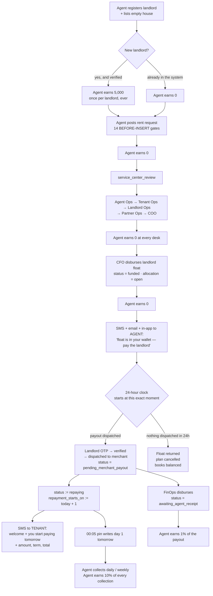

# The new Rent Plan flow — full implementation report

**Definitive spec, 23 September 2026.** Supersedes
[`repaying-gate-and-bonus-redesign-2026-09-23.md`](./repaying-gate-and-bonus-redesign-2026-09-23.md)
and [`implementation-spec-repaying-gate-and-commissions.md`](./implementation-spec-repaying-gate-and-commissions.md)
wherever they disagree. Background:
[`rent-plan-pipeline-and-commission-map.md`](./rent-plan-pipeline-and-commission-map.md),
[`commission-policy-decisions-2026-09-23.md`](./commission-policy-decisions-2026-09-23.md).

Nothing here has been applied. All production figures read 23 September 2026.

---

## Contents

1. [What changes, in one table](#1-what-changes-in-one-table)
2. [The new flow, stage by stage](#2-the-new-flow-stage-by-stage)
3. [What the agent earns](#3-what-the-agent-earns)
4. [When repayment starts](#4-when-repayment-starts)
5. [Every message that goes out](#5-every-message-that-goes-out)
6. [The 24-hour return](#6-the-24-hour-return)
7. [What is removed](#7-what-is-removed)
8. [Build order and acceptance tests](#8-build-order-and-acceptance-tests)
9. [Risks and what to watch](#9-risks-and-what-to-watch)

---

## 1. What changes, in one table

| | Today | After |
|---|---|---|
| Rent request posted | 5,000 wired (blocked by a typo) | **0, enforced** |
| Six approval desks | 0 | 0 |
| New landlord verified → agent | 5,000, **plus** 5,000 per rent request | **5,000, once per landlord** |
| New landlord verified → parent | 3,000 | **0** |
| New LC1 verified → agent | 2,000 | 2,000 |
| New LC1 verified → parent | 3,000 | **0** |
| **CFO disburses landlord float → agent** | **5,000 + 10,000** | **0** |
| CFO disburses landlord float → parent | 3,000 | **0** |
| **Landlord actually paid → agent** | 1% of the payout | **1% of the payout** — now the only payment at this stage |
| Each collection | 10% (8% + 2% for sub-agents) | unchanged |
| **Plan becomes `repaying`** | on the first collection | **when the landlord float leaves the agent's wallet** |
| **First repayment day** | funded + 1 | **the day after the landlord was paid** |
| Unpaid landlord after 24h | nothing happens | **float returned, plan cancelled** |
| Tenant told repayment is starting | nothing | **welcome SMS with the full summary** |
| Agent told float has arrived | email + in-app | **+ SMS, + reminders at 6h and 18h** |

**The principle:** money is earned for work completed, not for money received. The
agent is paid when the landlord is actually paid, and again as the tenant actually
repays.

---

## 2. The new flow, stage by stage



### Stage notes

| Stage | Status | What happens | Agent earns |
|---|---|---|---:|
| Landlord + house registered | — | verification by Landlord Ops / service centre | **5,000** if the landlord is new, **2,000** if the house listing is new |
| Rent request posted | `pending` → `service_center_review` | 14 gates, including the 50% eligibility gate and the tier cap; pricing is overwritten by `compute_rent_repayment` | **0** |
| Five approval desks | `…_approved` → `coo_approved` | landlord must be verified to pass | **0** |
| **CFO disburses landlord float** | **`funded`** | allocation created `open`, agent's landlord float credited, fee receivable recognised against L7 | **0** |
| Agent pays the landlord | payout `otp_verified` → `pending_merchant_payout` | landlord enters the OTP sent to their own phone; payout dispatched to a merchant | **0 yet** |
| **Money leaves the agent's wallet** | **`repaying`** | `repayment_starts_on` stamped as tomorrow; tenant welcomed by SMS | **0 yet** |
| FinOps confirms disbursement | payout `awaiting_agent_receipt` | allocation `paid_out_amount` bumped | **1% of the payout** |
| Tenant repays | `repaying` → `completed` | FIFO day attribution, oldest open day first | **10%** of every collection (8% if a sub-agent, 2% to the parent) |

---

## 3. What the agent earns

### The complete map

| Event | Agent | Parent agent |
|---|---:|---:|
| Empty house listed and verified | 2,000 | 2,000 |
| **New landlord verified** | **5,000** | **0** |
| **New LC1 chairperson verified** | 2,000 | **0** |
| Sub-agent registered | 10,000 | — |
| Rent request posted | **0** | 0 |
| Any approval desk | 0 | 0 |
| **CFO disburses landlord float** | **0** | **0** |
| **Landlord paid (FinOps confirmed)** | **1% of the payout** | 0 |
| Each rent collection | **10%** (8% if sub-agent) | **2%** if the collector is a sub-agent |

Pricing is fixed by `compute_rent_repayment` and cannot be negotiated in the app:

```
access_fee   = ROUND(rent × (1.33^(days/30) − 1))       -- 33% on a 30-day plan
               floored at CEIL((rent × (0.005×days + 0.10) + 0.10 × reg) / 0.90)
request_fee  = 10,000 if rent ≤ 200,000 else 20,000
total_repay  = rent + access_fee + request_fee
instalment   = CEIL(total_repay / days)
```

### Worked examples — 30-day daily plans, ordinary agent, new landlord and new house

| | Rent 100,000 | Rent 250,000 | Rent 400,000 | Rent 1,000,000 |
|---|---:|---:|---:|---:|
| Access fee | 33,000 | 82,500 | 132,000 | 330,000 |
| Request fee | 10,000 | 20,000 | 20,000 | 20,000 |
| **Total repayable** | **143,000** | **352,500** | **552,000** | **1,350,000** |
| Daily instalment | 4,767 | 11,750 | 18,400 | 45,000 |
| | | | | |
| House listing verified | 2,000 | 2,000 | 2,000 | 2,000 |
| Landlord verified | 5,000 | 5,000 | 5,000 | 5,000 |
| Rent request posted | 0 | 0 | 0 | 0 |
| Approval desks | 0 | 0 | 0 | 0 |
| **CFO disburses float** | **0** | **0** | **0** | **0** |
| **Landlord paid — 1%** | **1,000** | **2,500** | **4,000** | **10,000** |
| Collections — 10% of total | 14,300 | 35,250 | 55,200 | 135,000 |
| **Total earned per plan** | **22,300** | **44,750** | **66,200** | **152,000** |
| Earned **before** any collection | 8,000 (36%) | 9,500 (21%) | 11,000 (17%) | 17,000 (11%) |

### Before and after, on a 250,000 plan

| | Before | After | Change |
|---|---:|---:|---:|
| House listing verified | 2,000 | 2,000 | — |
| Landlord verified (agent) | 5,000 | 5,000 | — |
| Landlord verified (parent) | 3,000 | **0** | **−3,000** |
| CFO disburses float (agent) | **15,000** | **0** | **−15,000** |
| CFO disburses float (parent) | 3,000 | **0** | **−3,000** |
| Landlord paid — 1% | 2,500 | 2,500 | — |
| 30 collections at 10% | 35,250 | 35,250 | — |
| **Agent total** | **59,750** | **44,750** | **−15,000** |
| **Parent total** | 8,000 | **2,000** | **−6,000** |
| **Pre-collection share** | **41%** | **21%** | |

### What this means for agents

- **An agent who collects is barely affected.** The 10% is untouched and it is
  79% of the total on a 250,000 plan.
- **An agent who only acquires loses most.** 15,000 per funded plan disappears,
  and it was paid the moment money arrived rather than for delivering it.
- **The 1% rewards bigger errands.** It is worth less than the old flat 5,000
  below a 500,000 payout and more above it — which matches the effort and the
  risk of carrying the cash.
- **Nothing is clawed back.** Everything paid to date stays. All changes are
  forward-only, and **agents must be told before Phase 1 ships.**

### Removed streams, measured

| Stream | Payments to date | UGX | Running since |
|---|---:|---:|---|
| Event bonus 10,000 at funding | 1,404 | **14,040,000** | 2026-07-28 |
| Parent override, landlord verified | 2,473 | **7,405,000** | 2026-06-17 |
| Pipeline landlord bonus, per rent request | 1,177 | **5,885,000** | 2026-04-10 |
| Flat 5,000 at funding | 275 in September alone | 1,375,000 in September | long-standing |
| Parent override, tenant/landlord funded | 390 | 1,170,000 | 2026-06-16 |
| Parent override, LC1 verified | 15 | 45,000 | 2026-06-15 |

### Why new landlords still earn 5,000

The landlord bonus is for **bringing a new landlord into the network**, which is
genuine acquisition work and happens once. It survives unchanged at 5,000.

The guarantee that it is paid once is already in place —
`pay_landlord_registration_verified_bonus` fires only on the `verified`
`false → true` transition, checks a `registration_verification_bonus_paid` flag,
and carries an idempotency key. **No change to that function.**

What closes the gap is deleting the two paths that pay per *rent request* instead
of per *landlord*:

- `pay_listed_landlord_verified_bonus` — loops every rent request naming the
  landlord and pays one bonus each
- `credit-landlord-verification-bonus` — the edge function fired from
  `RentPipelineQueue.tsx` on every landlord-desk approval, keyed on
  `rent_request_id`, with **no idempotency key at all**

Measured damage from the second: **723 distinct landlords, 1,131 rent requests,
5,885,000 paid where 3,615,000 was due — 2,270,000 overpaid**, and 154 landlords
paid through both paths.

---

## 4. When repayment starts

### The rule

> A Rent Plan becomes `repaying` the moment the landlord float **leaves the
> agent's wallet** — when the payout is dispatched to a merchant agent, after the
> landlord has entered the OTP sent to their own phone.
>
> **The tenant's first repayment day is the day after that.**

### The trigger

An `AFTER UPDATE` trigger on `landlord_payouts`, firing when `status` becomes
`pending_merchant_payout`, setting **both fields in one statement**:

```sql
UPDATE public.rent_requests
   SET status              = 'repaying',
       repayment_starts_on = ((now() AT TIME ZONE 'Africa/Kampala')::date + 1)
 WHERE id = <the plan>
   AND status = 'funded';
```

Conditions: act only when the plan is currently `funded` (never re-stamp a plan
already repaying, or the date would move on every subsequent payout), be
idempotent, and be non-fatal so it can never block a payout.

### Why `repayment_starts_on` must be re-stamped

It is currently set to **funded + 1** at funding time. If a plan is funded on
Monday and the landlord is paid on Thursday, leaving the old value would make the
pin bill Tuesday, Wednesday and Thursday — **three days the agent could never have
collected, written permanently into a bill that is immutable by design.**

That is exactly the failure that produced phantom day-1 arrears on Faizal Kayondo
and Hamiss Mutyaba. Re-stamping is what stops it recurring on every funded plan.

### Why `pending_merchant_payout` is the right moment

| At `pending_merchant_payout` | |
|---|---|
| Agent's **spendable** landlord float | **reduced** — `get_agent_lp_float_available` subtracts every payout in `otp_verified` or `pending_merchant_payout` |
| Can the agent use that money for anything else? | **No** |
| `agent_landlord_float.balance` | unchanged |
| `allocation.paid_out_amount` | still 0 until FinOps disburses |

The agent's discretion over the money ends here, which is what the rule cares
about. The books catch up minutes later. And because repayment starts *tomorrow*,
a same-day merchant failure costs nothing — the agent retries and no collection
has been missed. **The next-day rule is the grace window.**

### Two timings that are deliberately different

| Moment | Payout status | What happens |
|---|---|---|
| Agent dispatches to merchant | `pending_merchant_payout` | **plan becomes `repaying`**, date stamped, **tenant welcomed** |
| FinOps confirms disbursement | `awaiting_agent_receipt` | **agent earns the 1%**, allocation `paid_out_amount` bumped |

These are minutes to hours apart and that is correct: the plan starts repaying
when the agent commits the money; the commission pays when the money is confirmed
gone. `post_landlord_payout_finops_commission` already fires at the second point
and needs no change. For scale, **944 payouts currently rest in
`awaiting_agent_receipt` against 81 `completed`** — so this is the normal resting
state, and the 1% does reliably pay.

### If a payout fails after repayment has started

On day 2 or later the tenant may already have paid. **Do not auto-revert to
`funded`** — that would orphan real collections. Instead: alert FinOps and
Landlord Ops naming the plan, the landlord and the amount; require a re-dispatch
against the same allocation; leave `status` and `repayment_starts_on` alone.

**107 payouts are currently `failed`, worth 74,700,000.** This will happen.

---

## 5. Every message that goes out

### To the agent

| # | When | Channel | Purpose |
|---|---|---|---|
| A1 | CFO disburses landlord float | **SMS** (new) + email + in-app | float has arrived; pay the landlord; deadline stated |
| A2 | 6 hours after funding, if no payout dispatched | **SMS** (new) | reminder |
| A3 | 18 hours after funding, if no payout dispatched | **SMS** (new) | warning — 6 hours left |
| A4 | 24 hours, no payout ever dispatched | **SMS** (new) + in-app | float returned, plan cancelled |
| A5 | Payout fails after dispatch | in-app + FinOps alert | retry required — **no penalty** |

**A1**
```
UGX {rent_amount} landlord float has been sent to your wallet for
{landlord_name} ({tenant_name}).

Pay the landlord within 24 hours — by {deadline_time} on {deadline_date} —
or the float will be returned and the Rent Plan cancelled.

Payouts run 06:00–22:00. Ref {ref}.
```

**A3**
```
Reminder: UGX {rent_amount} for landlord {landlord_name} is still in your
wallet. You have 6 hours left ({deadline_time}). After that the float is
returned and {tenant_name}'s Rent Plan is cancelled. Ref {ref}.
```

**A4**
```
The UGX {rent_amount} landlord float for {landlord_name} was not paid out
within 24 hours and has been returned. {tenant_name}'s Rent Plan has been
cancelled and can be submitted again. Ref {ref}.
```

### To the tenant

| # | When | Channel | Purpose |
|---|---|---|---|
| T1 | Plan becomes `repaying` | **SMS** (new) | welcome + repayment starts tomorrow + full summary |
| T2 | Plan cancelled at 24h | **SMS** (new) | explain, and say it can be re-submitted |

**T1 — the onboarding confirmation**
```
Welcome to Welile, {tenant_first_name}.

Your rent of UGX {rent_amount} has been paid to your landlord
{landlord_name}.

Your repayment starts TOMORROW, {repayment_starts_on}:
  UGX {instalment} {per day|per week}
  for {duration_days} days
  Total to repay: UGX {total_repayment}

Your agent {agent_name} ({agent_phone}) will collect from you.
Ref {ref}.
```

**T2**
```
{tenant_first_name}, the Rent Plan for your rent of UGX {rent_amount} could
not be completed because the landlord payment was not made in time. Nothing
is owed by you. Your agent can submit the request again. Ref {ref}.
```

### To the landlord

Unchanged — the OTP SMS already exists in `issue-landlord-payout-otp`.

### Four requirements for every new message

1. **Weekly plans must say "per week"** and quote `daily_repayment × 7`. The
   schedule bills a weekly plan the whole week on its due day; a tenant told a
   daily figure will be surprised by the real ask. This has caused confusion
   before.
2. **Idempotent** on `rent_request_id`, so a re-dispatched payout cannot send the
   welcome twice. Use the existing `sms_delivery_log` pattern.
3. **Non-fatal.** An SMS failure must never block a status transition or a payout.
4. **"Rent Plan", never "loan". "Returns", never "interest".** These go to
   customers.

Infrastructure exists — Yoola SMS on the same path `issue-landlord-payout-otp`
uses, with `sms_delivery_log` and a delivery sweep every 10 minutes.

---

## 6. The 24-hour return

### The rule

> The clock starts **at the exact moment the CFO disburses the landlord float to
> the agent's wallet**, and runs 24 hours from that timestamp. It stops the moment
> a payout is dispatched. Once the money is out of the wallet, a failed merchant
> payment is not the agent's problem — they retry, and they still start collecting
> the next day.

### The three outcomes at T+24h

| At 24 hours after funding | Outcome |
|---|---|
| **No payout ever dispatched** | **Auto-return the float, cancel the plan, balance the books** |
| A payout was dispatched and failed | **Nothing.** Agent retries; escalate to FinOps if still unresolved |
| A payout is in flight | **Nothing.** The money is moving |

The test is simply whether a `landlord_payouts` row for that rent request ever
reached `pending_merchant_payout` or beyond.

This is why the Patience Ruba case never enters the timer: her payout was
dispatched on day one, OTP-verified, and only then failed. The agent did nothing
wrong and the plan survives.

### On the payout window — my earlier objection was wrong

I previously argued the 24 hours should be counted in payout-window hours, because
`enforce_landlord_payout_eligibility` blocks all landlord payouts outside
**06:00–22:00 Africa/Kampala**.

That objection does not hold. **Any 24-hour period contains exactly 16 hours of a
06:00–22:00 daily window**, whatever time it starts. An agent funded at 21:30 has
30 minutes that evening plus the full 06:00–21:30 window the next day — still 16
usable hours. A strict 24-hour clock from the disbursement moment is simple,
predictable, and always gives the agent a full working window.

Two things still worth keeping: state the exact deadline in message A1 so there is
no ambiguity, and suppress the 6h/18h reminders that would land between 22:00 and
06:00 — waking an agent at 03:00 to tell them to do something they are forbidden
from doing helps nobody.

### What already exists

| Need | Existing, working today |
|---|---|
| Return float, cancel plan, balance the books | **`cancel_tenant_and_return_landlord_float(rent_request_id, reason)`** — returns each allocation and posts the ledger groups; reason ≥ 10 chars |
| Request/approve path for returns | `agent_allocation_return_requests` + `cfo_decide_allocation_return`, allocation status `return_pending` |
| Reverse one payout's effect | `refund_agent_float_for_payout` |
| **The exact timer pattern to copy** | **`detect_unpaid_float_promises()`** — flags unpaid promises after 2h, escalates to `critical` at 12h, writes `float_promise_alerts`, auto-closes when paid, runs every 15 minutes |

**One blocker.** `cancel_tenant_and_return_landlord_float` opens with
`IF v_caller IS NULL THEN RAISE EXCEPTION 'AUTH_REQUIRED'`. A cron has no
`auth.uid()`. It needs a service-role variant, or a `SECURITY DEFINER` wrapper
recording a named system actor, so the audit trail says *something* rather than
nothing.

---

## 7. What is removed

### Bonus paths

| Drop | Why |
|---|---|
| `trg_pay_listed_landlord_verified_bonus` + function | pays per rent request, not per landlord |
| `credit-landlord-verification-bonus` edge function + both `RentPipelineQueue.tsx` invocations | same, plus no idempotency key at all |
| `trg_pay_listed_rent_posted_bonus` + function | rent-request entry has no empty-house link; unreachable, mispriced and misspelled |
| `trg_credit_agent_rent_funded_bonus` | the duplicate 10,000 |
| **The flat 5,000 in `fund-agent-landlord-float`** | **replaced by the 1% at landlord-paid** |
| `trg_recruiter_override_landlord_verified` | parent gets nothing |
| `trg_recruiter_override_lc1_verified` | parent gets nothing |
| `trg_recruiter_override_tenant_landlord_funded` | parent gets nothing |
| `rent_request_posted`, `tenant_replacement`, `rent_funded_landlord_float` from `credit_agent_event_bonus` | no longer paid |

After this, **`credit_agent_event_bonus` has no involvement in the landlord or LC1
process at all** — both surviving bonuses call `create_ledger_transaction`
directly.

Keep `service_centre_setup` (25,000) and `tenant_placement` (10,000) in the price
list but **mark them explicitly as not yet wired** — otherwise they are the next
`rent_posted_listed`: a live-looking price that pays nothing.

### The landlord-payout gate in `v_rent_plan_schedule`

```sql
AND (COALESCE(rr.amount_repaid,0) > 0
     OR le.rent_request_id IS NULL
     OR le.paid_out > 0
     OR COALESCE(le.open_allocs,0) = 0)
```

Once `repaying` *means* "the landlord has been paid", this asks the same question
a second time, live, at 00:05 every night — and that live re-evaluation is what
caused the day-1 pin gap. **Replace the whole clause with `rr.status = 'repaying'`.**

### The 6-day pin catch-up

`pin_agent_expected_day_catchup(6)` exists only to repair days the clause above
caused to be missed. **Reduce the lookback from 6 days to 1** — not to 0, because a
cron that fails at 00:05 still needs the next night to cover for it. Keep
`pin_agent_expected_day_for_plan` as a cheap idempotent backstop.

---

## 8. Build order and acceptance tests

Each phase is independently shippable. Nothing has been applied.

### Phase 1 — commission corrections

| # | Change | Acceptance test |
|---|---|---|
| 1 | Drop `trg_pay_listed_rent_posted_bonus` + function | posting a rent request writes no commission leg |
| 2 | Drop `trg_pay_listed_landlord_verified_bonus` + function | verifying a landlord with 3 rent requests writes **one** 5,000 leg |
| 3 | Remove the three dead events from `credit_agent_event_bonus`; drop `trg_credit_agent_rent_funded_bonus` | funding a plan writes no `commission_accrual_ledger` row |
| 4 | Drop the three recruiter-override triggers | verifying a landlord or LC1 writes nothing to the parent |
| 5 | **Remove the flat 5,000 from `fund-agent-landlord-float`** | **funding writes zero commission legs** |
| 6 | Remove both `credit-landlord-verification-bonus` invocations; retire the edge function | approving at a landlord desk writes no commission leg |
| 7 | **Tell the agents before any of 1–6 ships** | — |

### Phase 2 — fuzzy duplicate detection

| # | Change | Acceptance test |
|---|---|---|
| 8 | GIN trigram index on `lc1_chairpersons.name` (landlords already have one) | planner uses it |
| 9 | `find_similar_landlords()` / `find_similar_lc1()`, village-scoped | returns matches with score, verified flag, registering agent |
| 10 | Check-as-you-type in both forms: block at ≥ 0.6 in the same village, warn at ≥ 0.4, override with a stored reason | re-registering an existing landlord is blocked with the match shown |

### Phase 3 — the repaying gate

| # | Change | Acceptance test |
|---|---|---|
| 11 | Agent SMS (A1) on landlord float funding, with the exact deadline | logged in `sms_delivery_log` |
| 12 | **Trigger on `pending_merchant_payout`: `status := 'repaying'`, `repayment_starts_on := Kampala today + 1`** | plan funded Mon, landlord paid Thu → `repayment_starts_on = Fri`, and **no pin rows for Tue/Wed/Thu** |
| 13 | Tenant welcome SMS (T1) from the same transition — weekly-aware, idempotent | a weekly plan quotes `daily × 7` and says "per week" |
| 14 | Leave `post_landlord_payout_finops_commission` unchanged | exactly one 1% group per payout |
| 15 | Replace the payout-evidence clause in `v_rent_plan_schedule` with `status = 'repaying'` | pin count unchanged for repaying plans; `funded` plans produce none |
| 16 | Pin catch-up lookback 6 → 1 | no new open days appear on any plan |
| 17 | Payout failing **after** repayment started → alert, no status revert | plan stays `repaying`, FinOps alerted |

### Phase 4 — the 24-hour return

| # | Change | Acceptance test |
|---|---|---|
| 18 | Reminder A2 at 6h, warning A3 at 18h, suppressed between 22:00 and 06:00 | a plan funded 21:30 is not messaged at 03:30 |
| 19 | Detector modelled on `detect_unpaid_float_promises`, into `landlord_float_idle_alerts` | a plan with a dispatched payout never appears |
| 20 | Service-role variant of `cancel_tenant_and_return_landlord_float` with a named system actor | audit row names the system actor, not null |
| 21 | **Auto-cancel only where no payout ever reached `pending_merchant_payout`** | the Patience Ruba shape survives untouched |
| 22 | Tenant cancellation SMS (T2) + a re-submission route | a cancelled request can be submitted again |

---

## 9. Risks and what to watch

### The one that must not be got wrong — item 12

Everything else is recoverable. Stamping the wrong `repayment_starts_on` writes
permanent arrears into a bill that is immutable by design, and we have two live
plans showing exactly what that looks like.

**Before it ships, run it read-only over the 103 currently-`funded` plans** and
confirm every `repayment_starts_on` it would write falls on or after the day that
plan's landlord payout was dispatched.

### Agent earnings drop immediately

15,000 per funded plan disappears the day Phase 1 ships, and the parent override
goes with it. On a 250,000 plan the agent falls from 59,750 to 44,750. **Tell
agents first.** Discovering it from a wallet balance is how trust is lost.

### The 3,795 plans in `service_center_review`

Five times the number of repaying plans. Nothing in this work touches that
backlog, but it is where the real throughput problem is, and it will dominate any
measurement of whether these changes helped.

### 107 failed payouts, 74,700,000

The failed-payout path is currently unmonitored. Items 17 and 19 add the alarms;
until they exist, a plan can go `repaying` against a landlord who was never paid
and nobody will know.

### Two `credit_recruiter_override` functions

Production has two functions of that name with different signatures, different
tables and different amounts. Dropping the three override triggers removes the
callers this work cares about, but the overloads remain. **One should be deleted**
before something calls the wrong one.

### `agent_earnings` is still silently failing

Four writers send a `currency` column the table does not have; every insert fails
and no caller checks. The money is safe — it goes through the ledger — but the
agent-facing earnings feed has been stale since April. Decide whether to fix the
payloads or retire the table; do not leave a feed that looks live and is five
months old.

---

## Terminology

Rent Plan (never "loan"), Supporter (never "lender"), Returns (never "interest" or
"ROI"). All amounts UGX.
