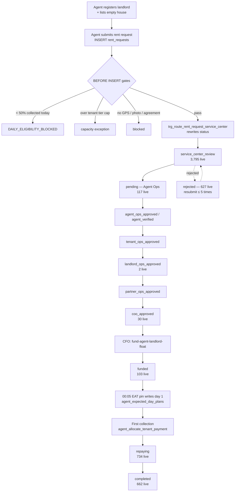
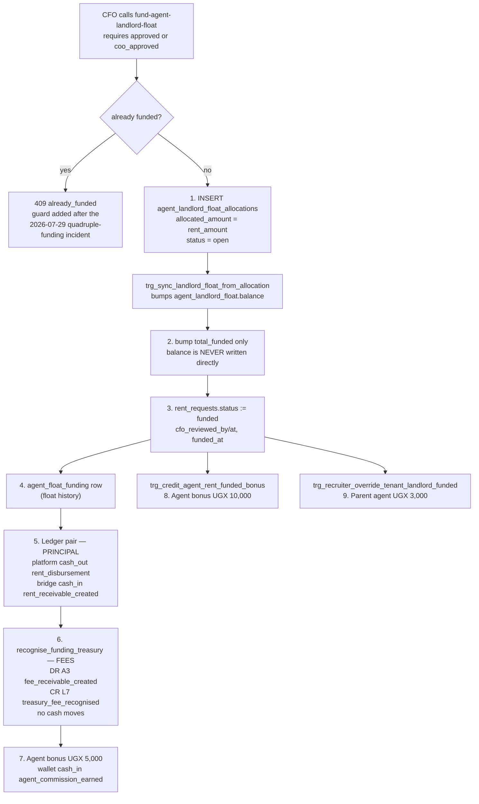
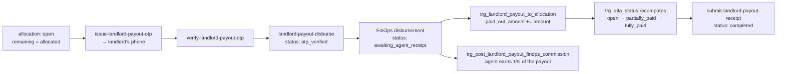
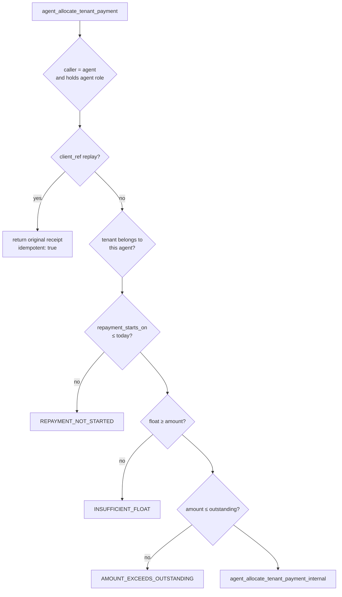
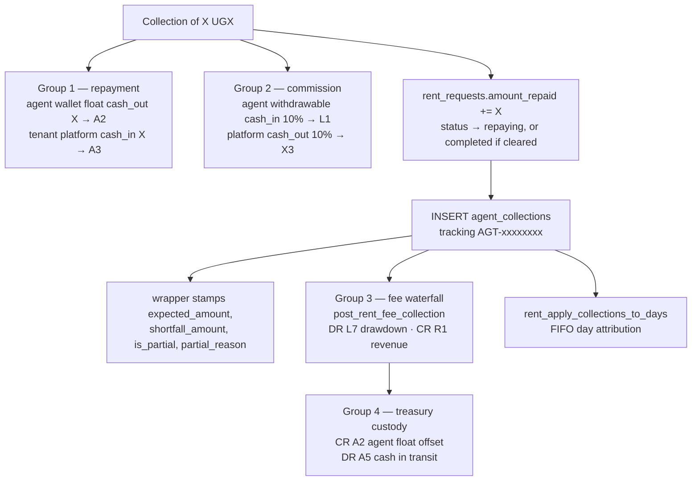

# The Rent Plan pipeline, end to end — and what it pays out

**Scope.** Everything from the moment an agent submits a rent request to the moment
the plan is `repaying` and money is coming back: every status, every gate, every
table, the pinned bill, the settlement books, what happens the instant the CFO
disburses landlord float, and **how much commission is earned at each stage**.

**Method.** Read from the live production database on **23 September 2026** —
`pg_proc` bodies, trigger catalogue, `cron.job`, and the `general_ledger` itself —
plus the edge functions in `supabase/functions/`. Migration files were not trusted;
`supabase/migrations/` does not faithfully reflect the live schema.

**All figures are as at 23 September 2026 and cover 1–23 September unless stated.
Re-derive before quoting — collections arrive continuously.**

---

## Contents

1. [The eight books](#1-the-eight-books)
2. [Stage map: pending → repaying](#2-stage-map-pending--repaying)
3. [Stage 0 — before the request exists](#3-stage-0--before-the-request-exists)
4. [Stage 1 — the agent submits](#4-stage-1--the-agent-submits)
5. [Stage 2 — the six-desk approval chain](#5-stage-2--the-six-desk-approval-chain)
6. [Stage 3 — the CFO disburses landlord float](#6-stage-3--the-cfo-disburses-landlord-float)
7. [Stage 4 — the agent pays the landlord](#7-stage-4--the-agent-pays-the-landlord)
8. [Stage 5 — the pin: the bill is written](#8-stage-5--the-pin-the-bill-is-written)
9. [Stage 6 — collection, and the four ledger groups](#9-stage-6--collection-and-the-four-ledger-groups)
10. [Stage 7 — the settlement book](#10-stage-7--the-settlement-book)
11. [The commission master table](#11-the-commission-master-table)
12. [What it actually paid in September](#12-what-it-actually-paid-in-september)
13. [Findings](#13-findings)

---

## 1. The eight books

Eight tables carry the whole story. Nothing else is authoritative.

| # | Table | What one row means | Written by |
|---|---|---|---|
| 1 | `rent_requests` | the Rent Plan itself — price, term, status, `amount_repaid` | 50 triggers + staff RPCs |
| 2 | `agent_landlord_float_allocations` | money ring-fenced for **this plan's landlord** | `fund-agent-landlord-float` |
| 3 | `landlord_payouts` | an actual payment to the landlord | agent → OTP → FinOps |
| 4 | `agent_expected_day_plans` | **the bill** — this plan owes this much on this day | cron, 00:05 EAT, once |
| 5 | `agent_collections` | **the receipt book** — this agent spent this much float at this moment | `agent_allocate_tenant_payment` |
| 6 | `rent_day_settlements` | which day a given receipt settled | `rent_apply_collections_to_days` |
| 7 | `general_ledger` | every shilling, double-entry | `create_ledger_transaction` only |
| 8 | `commission_accrual_ledger` | flat event bonuses | `credit_agent_event_bonus` |

Two of these are constantly confused, so state it plainly:

> `agent_expected_day_plans` is **the bill**. `agent_collections` is **the receipt
> book**. Dividing one total by the other overstates coverage by roughly 2×,
> because today's receipts routinely pay off *older* bills that today's
> denominator never contained.

Three supporting caches exist and are **never** authoritative:
`agent_landlord_float.balance` (derived by `trg_sync_landlord_float_from_allocation`),
`wallet_balances_projection` (derived from the ledger), and `agent_earnings`
(effectively dead — see [Findings](#13-findings)).

---

## 2. Stage map: pending → repaying



**Live status distribution, 23 Sep 2026** (all 6,204 rent requests):

| Status | Plans | Outstanding (UGX) |
|---|---:|---:|
| `service_center_review` | 3,795 | 1,038,673,438 |
| `repaying` | 734 | 247,009,098 |
| `completed` | 662 | 2,560,333 |
| `rejected` | 627 | 310,999,907 |
| `deleted_by_agent` | 130 | 70,362,111 |
| `pending` | 117 | 63,429,661 |
| `funded` | 103 | 59,566,265 |
| `coo_approved` | 30 | 13,986,250 |
| `cancelled` | 4 | 917,801 |
| `landlord_ops_approved` | 2 | 894,500 |

Note there is **no `approved` and no `disbursed` row live** — those statuses exist in
the code path but the CFO funding step writes `funded` directly.

---

## 3. Stage 0 — before the request exists

Two earning events happen before any Rent Plan is posted, and they matter because
they are the agent's only income until a plan funds.

| Event | Who is paid | Amount | Mechanism |
|---|---|---:|---|
| Empty house listed and verified | agent | **2,000** | `credit_agent_event_bonus('house_listed')` |
| …same event, recruiter override | parent agent | **2,000** | `credit_recruiter_override('house_listed_verified')` |
| Landlord registered and verified | agent | **5,000** | ledger `agent_commission_earned`, source `landlords` |
| …same event, recruiter override | parent agent | **3,000** | `credit_recruiter_override('landlord_verified')` |
| LC1 chairperson verified, recruiter | parent agent | **3,000** | `credit_recruiter_override('lc1_chairperson_verified')` |
| Sub-agent registration | recruiting agent | **10,000** | `credit_agent_event_bonus('subagent_registration')` |

---

## 4. Stage 1 — the agent submits

One `INSERT` into `rent_requests` fires **14 BEFORE-INSERT triggers**. Any one of
them can refuse the row. This is where the business rules actually live — not in
the app.

```mermaid
flowchart LR
    I["INSERT rent_requests"] --> B1["enforce_agent_daily_eligibility<br/>50% gate"]
    B1 --> B2["enforce_agent_rent_request_capacity<br/>per-tenant tier cap"]
    B2 --> B3["enforce_no_duplicate_rent_request<br/>+ no_duplicate_after_rejection"]
    B3 --> B4["enforce_rent_request_gps<br/>tenant_photo · landlord_agreement<br/>landlord_registered"]
    B4 --> B5["enforce_rent_request_formula<br/>OVERWRITES the pricing"]
    B5 --> B6["rent_request_default_repayment_start<br/>stamp_repayment_frequency"]
    B6 --> B7["route_rent_request_service_center<br/>status := service_center_review"]
    B7 --> OK["row stored"]
```



### The 50% eligibility gate

`enforce_agent_daily_eligibility` reads `v_agent_daily_eligibility` and blocks the
insert when the agent's best of three readings is under **0.50**:

```sql
v_best_pct := GREATEST(effective_pct, raw_today_pct, raw_yesterday_pct);
IF v_best_pct < 0.50 THEN RAISE EXCEPTION 'DAILY_ELIGIBILITY_BLOCKED: ...'
```

Two things about it that are easy to get wrong:

- **The threshold is 50%, not 20%.**
- **An agent with no active tenants passes automatically** — `active_count = 0`
  returns early. A brand-new agent is never blocked; only an agent with a book is.
- It is bypassable in-session via `app.bypass_daily_eligibility`.

### Pricing is not negotiable

`enforce_rent_request_formula` calls `compute_rent_repayment(rent, days)` and
**overwrites** whatever the client sent, on insert *and* on update:

```
access_fee   = ROUND(rent × (1.33^(days/30) − 1))
               floored at CEIL((rent × (0.005×days + 0.10) + 0.10 × reg) / 0.90)
request_fee  = 10,000  if rent ≤ 200,000   else 20,000
total_repay  = rent + access_fee + request_fee
daily_repay  = CEIL(total_repay / days)
```

For a 30-day plan the access fee is exactly 33% of rent unless the floor bites.

**Commission at this stage: 0** — see [Finding 2](#finding-2--four-event-bonuses-are-defined-and-have-never-once-paid);
a 5,000 "rent request posted" bonus is wired but has never fired.

---

## 5. Stage 2 — the six-desk approval chain

`service_center_review → pending (Agent Ops) → agent_ops_approved → tenant_ops_approved
→ landlord_ops_approved → partner_ops_approved → coo_approved`

`approve-rent-request` sets `status='approved'`, stamps `approved_by/at`,
`funded_at`, `schedule_status='active'`, and calls `recognise_funding_treasury`.

Along the way `trg_enforce_landlord_verified_before_approval` will refuse the
transition with `LANDLORD_NOT_VERIFIED` if the landlord has not been verified, and
`trg_verify_requested_house_on_landlord_ops_review` verifies the house at the
Landlord Ops desk.

**Commission at every desk in this chain: 0.** The code says so explicitly:

```ts
// No approval-time bonus is paid here anymore.
...
agent_bonus_paid: 0,
```

This is the longest stage by far — 3,795 plans are sitting in
`service_center_review` against 734 repaying.

---

## 6. Stage 3 — the CFO disburses landlord float

This is the pivot of the whole system. One call to `fund-agent-landlord-float`
does **nine** things, in this order, and the order matters.



### What the money does

| Step | Ledger legs | Cash effect |
|---|---|---|
| Principal | `platform cash_out rent_disbursement` / `bridge cash_in rent_receivable_created` | company cash → agent's LP float |
| Fees | `DR A3 fee_receivable_created` / `CR L7 treasury_fee_recognised` | **none** — accounting only |

The fee leg exists because the tenant owes `principal + access + registration`,
and the repayment waterfall later credits A3 for the **whole** instalment. Without
recognising the fee receivable at funding, A3 would be over-credited by exactly
(access + registration) across the plan's life. It also establishes the L7 credit
that each repayment draws down — `assert_funding_treasury_recognised()` enforces
that ordering, so a repayment cannot push L7 into an unexplained debit.

### Commission at funding — **three separate payments**

| Paid to | Amount | Source | Ledger category |
|---|---:|---|---|
| Agent | **5,000** | edge function `RENT_FUNDED_BONUS` | `agent_commission_earned`, source `rent_requests` |
| Agent | **10,000** | trigger → `credit_agent_event_bonus('rent_funded_landlord_float')` | `agent_commission`, source `commission_accrual_ledger` |
| Parent agent | **3,000** | trigger → `credit_recruiter_override('tenant_landlord_funded')` | `agent_commission`, source `rent_requests` |

**The agent receives UGX 15,000 per funded Rent Plan, from two independent code
paths that neither knows about the other.** Both are individually idempotent; the
duplication is by construction, not by accident of retry. Whether 15,000 is the
intended figure is a product question — the documentation says 5,000.

September: 275 plans funded → **1,375,000** (5k path) + **2,750,000** (10k path)
+ **585,000** in recruiter overweights across 195 events.

---

## 7. Stage 4 — the agent pays the landlord

The allocation is `open`. The agent now physically pays the landlord, which is
its own pipeline:



`apply_landlord_payout_to_allocation` only acts once the payout reaches
`pending_finops_disbursement | awaiting_agent_receipt | disbursed | completed`,
and locks itself via `allocation_applied_id` so a later status change cannot
re-apply the same payout.

### Commission at this stage

| Paid to | Amount | Mechanism |
|---|---:|---|
| Agent | **1% of the payout** | `post_landlord_payout_finops_commission` (ROUND, idempotent on `general_ledger`) |

September: 255 payouts → **1,543,600**.

### Why this stage gates repayment

`v_rent_plan_schedule` — the view the bill is built from — carries this clause:

```sql
AND (COALESCE(rr.amount_repaid,0) > 0
     OR le.rent_request_id IS NULL
     OR le.paid_out > 0
     OR COALESCE(le.open_allocs,0) = 0)
```

A plan with **nothing repaid yet, an open allocation, and zero paid out** is
excluded from the schedule entirely. That is the right instinct — do not bill a
tenant whose landlord has not been paid — but it is a **deadlock**: no schedule →
no pin → nothing for the agent to collect → `amount_repaid` stays 0 → no schedule.
See [Finding 1](#finding-1--the-landlord-payout-gate-is-a-deadlock).

---

## 8. Stage 5 — the pin: the bill is written

Cron `pin-agent-expected-day-eat-midnight` (`5 21 * * *` UTC = **00:05 EAT**) calls
`pin_agent_expected_day_catchup(6)`, which:

1. runs `pin_agent_expected_day(d)` for **today and the previous 6 days**;
2. then re-runs `rent_apply_collections_to_days` for every plan with an open day
   in that window, so a day back-filled in step 1 is immediately re-attributed.

`pin_agent_expected_day` refuses `p_day > today` and `p_day < rent_arrears_go_live()`
(**2026-09-10**), then inserts one row per plan from
`rent_plan_schedule_days(day, day) ⋈ v_rent_plan_schedule`, `ON CONFLICT DO NOTHING`.

A second pass adds a **past-term fallback** for agents who would otherwise have no
bill at all that day: plans past their term, still owing, non-weekly, scoped only
to agents with nothing else scheduled.

> **A plan funded today is absent from today's bill, and that is correct.**
> A Rent Plan approved today starts repaying tomorrow. Do not "fix" this and do
> not back-fill days before a plan was funded, even when `term_start` is back-dated.

Cron `sweep-unapplied-rent-collections-eat-midnight` runs five minutes later
(`10 21 * * *` = 00:10 EAT) so pre-paid surplus lands on the day the pin just
created.

**Commission at this stage: 0.** The pin moves no money.

---

## 9. Stage 6 — collection, and the four ledger groups

Entry point is `AgentTenantCollectDialog.tsx` → `agent_allocate_tenant_payment`.
The offline queue calls the same RPC so offline and online produce identical rows.
The client issues it **once** and never auto-retries; if it stalls past 45 s it
*queries* `agent_collections` to discover whether it committed.

### The float model — the thing that explains everything

An agent does **not** pass the tenant's cash through the system. The agent holds
company float, and "collecting" spends that float against the tenant's plan; the
agent keeps the tenant's cash and settles up separately. The ledger names it
`agent_float_used_for_rent`.

Two consequences:

- Nothing verifies the tenant physically paid. The control is **economic** — the
  agent is out of pocket the instant they record it.
- **An agent with no float cannot collect, however willing the tenant.** An
  "agent didn't collect" number is often a float problem, not a field problem.

### The gates



`trg_enforce_agent_full_freeze` (BEFORE INSERT on `agent_collections`) blocks
frozen agents — the same trigger function guards seven tables.

### The four ledger groups



**Group 3** decomposes the instalment pro-rata against the plan's weights
(principal / access fee / registration fee), with largest-remainder rounding and a
hard invariant that the parts foot exactly. Only the fee portion becomes revenue;
the principal portion is capital returning.

**Group 4** moves the fee portion of the cash out of the agent's custody into
Treasury. Custody only — total cash (A1+A2+A5) is unchanged, Treasury cash (A1+A5)
rises.

Groups 3 and 4 are **non-fatal**: a failure files a row in
`rent_fee_collection_exceptions` for replay rather than unwinding the payment.
Plans funded before 2026-09-08 return `out_of_scope_legacy` and post groups 1 and 2
only.

### Commission at this stage

`get_agent_commission_rate(agent)` is the single source of truth and feeds the
figure the agent sees *before* collecting:

| Collector | Agent gets | Recruiter gets |
|---|---:|---:|
| Ordinary agent | **10%** | — |
| Sub-agent with a `verified`/`approved`/`accepted` link to a different parent | **8%** | **2%** |
| Sub-agent on the commission whitelist | **10%** | — |

The recruiter takes the **residual** of the rounded total so the group still
balances to the cent. Commission lands in **withdrawable** immediately — it is the
agent's own earnings, entirely separate from float.

Verified against the ledger for 1–23 September: **22,335,860 commission on
223,239,404 collected = 10.0005%.** Of that, **2,637,266** was recruiter override,
implying roughly 132M of the volume was collected by sub-agents.

---

## 10. Stage 7 — the settlement book

`rent_day_settlements` records **how much of each receipt settled which day**.
Two constraints carry the integrity:

- a composite FK to `(day, rent_request_id)` on the pin — a settlement cannot
  exist against a day that was never billed;
- unique `(collection_id, day)`, with re-application topping the row up.

`rent_apply_collections_to_days(plan)` attributes unapplied money oldest-day and
oldest-money first, as a **single set operation**: each payment covers
`[money before it, + its unapplied amount)`, each day needs
`[need before it, + its remaining amount)`, and the overlap is exactly how much of
that payment lands on that day. FIFO falls out of the sort. A plan-scoped advisory
lock stops two concurrent collections claiming the same day.

Three views sit on top:

| View | Grain | Answers |
|---|---|---|
| `v_rent_day_ledger` | plan × day | expected, settled, remaining, is_settled |
| `v_rent_plan_arrears` | plan | days behind, arrears, due today, oldest open day |
| `v_rent_collection_unapplied` | receipt | how much of this receipt has landed anywhere |

Arrears **exclude today**, which is not yet late.

Reversal is handled by `trg_rent_drop_settlements_on_reversal`, which watches for
the `[REVERSED:` marker appearing in `notes` and releases the days that collection
had settled.

**Commission at this stage: 0.** Attribution moves no money.

---

## 11. The commission master table

Every earning event in the Rent Plan pipeline, with the mechanism that pays it.
Verified from production function bodies on 23 September 2026.

| # | Stage | Trigger event | Paid to | Amount | Mechanism |
|---|---|---|---|---:|---|
| 1 | Pre-plan | House listed + verified | agent | 2,000 | `credit_agent_event_bonus('house_listed')` |
| 2 | Pre-plan | …same, override | parent | 2,000 | `credit_recruiter_override('house_listed_verified')` |
| 3 | Pre-plan | Landlord verified | agent | 5,000 | ledger, source `landlords` |
| 4 | Pre-plan | …same, override | parent | 3,000 | `credit_recruiter_override('landlord_verified')` |
| 5 | Pre-plan | LC1 chairperson verified, override | parent | 3,000 | `credit_recruiter_override` |
| 6 | Pre-plan | Sub-agent registered | recruiter | 10,000 | `credit_agent_event_bonus` |
| 7 | **Submit** | Rent request posted | agent | **0** ⚠ | wired, never fires — [Finding 2](#finding-2--four-event-bonuses-are-defined-and-have-never-once-paid) |
| 8 | **Approval ×6** | Any desk approves | — | **0** | explicitly removed |
| 9 | **CFO funds** | `funded_at` set | agent | **5,000** | `fund-agent-landlord-float` |
| 10 | **CFO funds** | `funded_at` set | agent | **10,000** | `trg_credit_agent_rent_funded_bonus` |
| 11 | **CFO funds** | `funded_at` set | parent | **3,000** | `trg_recruiter_override_tenant_landlord_funded` |
| 12 | **Landlord paid** | payout → `awaiting_agent_receipt` | agent | **1% of payout** | `post_landlord_payout_finops_commission` |
| 13 | **Pin** | bill written | — | **0** | no money moves |
| 14 | **Each collection** | float spent on the plan | agent | **10%** (or 8%) | `get_agent_commission_rate` |
| 15 | **Each collection** | …sub-agent case | parent | **2%** | same group, residual rounding |
| 16 | Settlement | day attribution | — | **0** | derived only |
| 17 | Reversal | within 7 days | agent | **−10%** clawback | `agent_unallocate_tenant_payment` |

### A worked example — 250,000 rent, 30 days, ordinary agent

```
Pricing        rent 250,000 · access 82,500 (33%) · registration 20,000
               total repayable 352,500 · daily 11,750

Stage 3   listing + landlord verified          →  agent  7,000
Stage 1   request posted                       →  agent      0
Stage 2   six approval desks                   →  agent      0
Stage 3   CFO funds landlord float             →  agent 15,000   (5,000 + 10,000)
Stage 4   agent pays landlord 250,000 @ 1%     →  agent  2,500
Stage 6   30 collections × 11,750 × 10%        →  agent 35,250
                                                  ───────────────
          Total agent earnings on the plan        agent 59,750
```

Of that, **24,500 (41%) is paid before a single shilling is collected** — the
economics deliberately front-load acquisition. The remaining 35,250 accrues only
as the money actually comes back.

---

## 12. What it actually paid in September

Ledger, `ledger_scope='wallet'`, `direction='cash_in'`, **1–23 September 2026**.

| Stage | Source table | Events | UGX |
|---|---|---:|---:|
| Collections — 10% / 8% + 2% | `agent_collections` | 8,517 legs | **22,335,860** |
| Merchant cash-out settlement | `withdrawal_requests` | 1,604 | 5,232,238 |
| Event bonuses (funding 10k, sub-agent 10k, listing 2k) | `commission_accrual_ledger` | 392 | 3,200,000 |
| Funding 5k + landlord verification 5k | `rent_requests` | 583 | 2,915,000 |
| Promissory note commission | `promissory_notes` | 1,765 | 2,034,000 |
| Landlord payout 1% | `landlord_payouts` | 255 | **1,543,600** |
| Portfolio commission | `investor_portfolios` | 61 | 1,610,781 |
| Landlord-side overrides | `landlords` | 261 | 1,053,000 |
| Recruiter override at funding (3k) | `rent_requests` | 195 | **585,000** |
| House-listing overrides (2k) | `house_listings` | 257 | 514,000 |
| Listing bonus approvals | `listing_bonus_approvals` | 90 | 180,000 |

Splitting the two 5,000 bonuses that share `source_table='rent_requests'`:

| | Events | UGX |
|---|---:|---:|
| Landlord verification bonus | 304 | 1,540,000 |
| Rent funded bonus (5k path) | 275 | 1,375,000 |

And `commission_accrual_ledger` for the same window:

| Event type | Events | Unit | UGX |
|---|---:|---:|---:|
| `rent_funded_landlord_float` | 275 | 10,000 | 2,750,000 |
| `subagent_registration` | 31 | 10,000 | 310,000 |
| `house_listed` | 90 | 2,000 | 180,000 |

**275 plans funded in September cost 4,710,000 in up-front agent earnings**
(1,375,000 + 2,750,000 + 585,000) before any repayment — an average of
**17,127 per funded plan**.

### Volume context

| | Value |
|---|---:|
| Landlord float allocations created | 285 plans, 169,435,000 principal |
| Receipts written | 5,111 |
| Cash recorded collected | 223,239,404 |
| …of which carry a `[REVERSED:` marker | **1,225 receipts · 98,647,719** |
| Pinned bill rows (since 2026-09-10) | 6,398 rows · 125,152,580 |
| Settlements written | 6,695 rows · 73,536,310 |

---

## 13. Findings

### Finding 1 — the landlord-payout gate is invisible, and cannot self-release

`v_rent_plan_schedule` excludes a plan that has `amount_repaid = 0`, an `open`
allocation, and `paid_out = 0`. No schedule → no pin → the collect screen offers
nothing → `amount_repaid` can never rise → the plan stays excluded. Nothing about
the plan itself can break the loop; only the landlord payout landing can.

**Currently holding 25 plans across 19 agents, 972,371 of daily instalments,
27,420,938 outstanding** — invisible to every target, every coverage figure and
every arrears view. The oldest started repaying 2026-09-12.

> **Correction (23 Sep 2026, same day).** An earlier version of this section called
> this a deadlock and cited Patience Ruba (`6789bb19`) as a plan wrongly blocked.
> Checking `landlord_payouts` for that plan shows the gate was **right**: her
> 450,000 payout to landlord kayemba sharif was raised on 18 September, OTP-verified,
> and then **failed**; a second attempt was raised on 23 September at 12:10 and is
> `pending_merchant_payout`. The landlord has never been paid, so not billing the
> tenant is correct behaviour, not a bug.
>
> The loop is also self-healing once the payout lands:
> `pin_agent_expected_day_for_plan` back-fills from `GREATEST(term_start, go_live)`
> to today with **no 6-day limit**, and runs inside `rent_apply_collections_to_days`
> on the plan's first collection. No day is lost.

So the defect is **not** the gate. It is that a plan can sit in this state for days
with nobody told: the agent sees a tenant who simply is not there, the tenant is
never visited, and no queue anywhere says "funded, landlord unpaid, billing
suspended". The fix is visibility and a failed-payout alarm — not loosening the
gate. Of the 25 plans, how many are blocked by a genuinely failed payout versus an
unrecorded one is the question to answer next.

### Finding 2 — four event bonuses are defined and have never once paid

`credit_agent_event_bonus` knows eight event types. `commission_accrual_ledger` has
**never** contained a row for four of them:

| Event type | Amount | Rows ever |
|---|---:|---:|
| `rent_request_posted` | 5,000 | **0** |
| `tenant_placement` | 10,000 | **0** |
| `tenant_replacement` | 20,000 | **0** |
| `service_centre_setup` | 25,000 | **0** |

For `rent_request_posted` the cause is identified. The trigger
`pay_listed_rent_posted_bonus` calls:

```sql
PERFORM public.credit_agent_event_bonus(NEW.agent_id, 'rent_posted_listed', ...);
```

but the function's `CASE` only recognises `'rent_request_posted'`. The unmatched
key makes `v_amount` NULL, the function returns
`{"status":"error","message":"Unknown event_type: rent_posted_listed"}`, and
`PERFORM` discards it. **Every rent request posted against a house listing since
this trigger shipped has silently failed to pay its 5,000 bonus, with no error
anywhere.** A one-word fix, but it changes what agents are owed — worth deciding
whether to back-pay.

### Finding 3 — the funding bonus is paid twice, by design collision

The edge function pays 5,000 and an independent AFTER-UPDATE trigger pays 10,000
for the same event. Both are idempotent; neither knows about the other. The agent
receives **15,000** per funded plan while `docs/AGENT_SYSTEM_ARCHITECTURE.md` and
the edge function constant both say 5,000. In September that is **4,125,000** paid
against a documented expectation of 1,375,000.

This is a product decision, not obviously a bug — but the two paths should be
collapsed into one so the number is stated in one place.

### Finding 4 — 44% of September's recorded collections are reversed, and still count

| | Receipts | UGX |
|---|---:|---:|
| Normal | 3,838 | 123,174,685 |
| `notes` carry `[REVERSED:` | **1,225** | **98,647,719** |
| `reversed_at` set, no marker | 48 | 1,417,000 |

`agent_reverse_tenant_allocation` never clears `amount` and never deletes the row —
it appends a marker to `notes`. Every dashboard tile is `SUM(amount)`, so **a
reversed collection still reads as collected**. At 44% of the month's value this
is no longer a theoretical risk.

There are also now **two** reversal representations (`notes` marker and
`reversed_at`), and only the marker is watched by
`trg_rent_drop_settlements_on_reversal`. The 48 rows with `reversed_at` set but no
marker may still be holding days settled.

### Finding 5 — `agent_earnings` is dead but still written to

The last `rent_funded_bonus` row in `agent_earnings` is **2026-04-01**; the table's
last row of any kind is 2026-07-20. Meanwhile the ledger paid that bonus 275 times
in September. `fund-agent-landlord-float` still inserts into it and ignores the
result.

Nothing is lost — `general_ledger` is the truth — but any report reading
`agent_earnings` has been silently wrong for five months.

### Finding 6 — the pin's catch-up window can open arrears retroactively

`pin_agent_expected_day_catchup(6)` re-pins the last **6 days**. A plan that
becomes schedule-eligible today will have up to six past days written into the bill
at 00:05, and the same function immediately re-attributes collections to them.

This is deliberate and self-correcting, but it means **an agent can wake up behind
on days they were never shown**. On 2026-09-17 at 10:00 a repair wrote **1,343
rows** for days 09-10 to 09-16 at once, and the daily pin count roughly doubled
from that morning (≈225/day → ≈470/day). Anything that alerts on "days behind"
should suppress days pinned after the fact.

---

## Appendix — the cron schedule that drives all of it

| Job | Schedule (UTC) | EAT | Calls |
|---|---|---|---|
| `pin-agent-expected-day-eat-midnight` | `5 21 * * *` | 00:05 | `pin_agent_expected_day_catchup()` |
| `agent-ops-snapshot-cycle` | `10 0 * * *` | 03:10 | `agent_ops_run_snapshot_cycle()` |
| `sweep-unapplied-rent-collections-eat-midnight` | `10 21 * * *` | 00:10 | `rent_sweep_unapplied_collections()` |
| `snapshot-agent-daily-eligibility` | `30 0 * * *` | 03:30 | `snapshot_agent_daily_eligibility(1)` |
| `auto-close-fully-repaid-rents` | `0 23 * * *` | 02:00 | `auto_close_fully_repaid_rents()` |
| `trigger-agent-liability-daily` | `0 23 * * *` | 02:00 | `trigger_agent_liability_for_unpaid_rents()` |
| `reconcile-agent-landlord-float` | `17 * * * *` | hourly | `reconcile_agent_landlord_float_all(...)` |
| `notify-agent-collection-lapse-daily` | `0 6 * * *` | 09:00 | lapse notifications |

---

## Terminology

Rent Plan (never "loan"), Supporter (never "lender"), Returns (never "interest" or
"ROI"). All amounts UGX.
