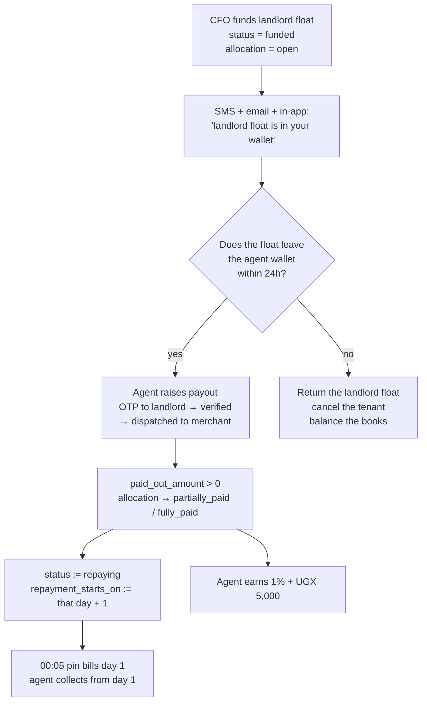
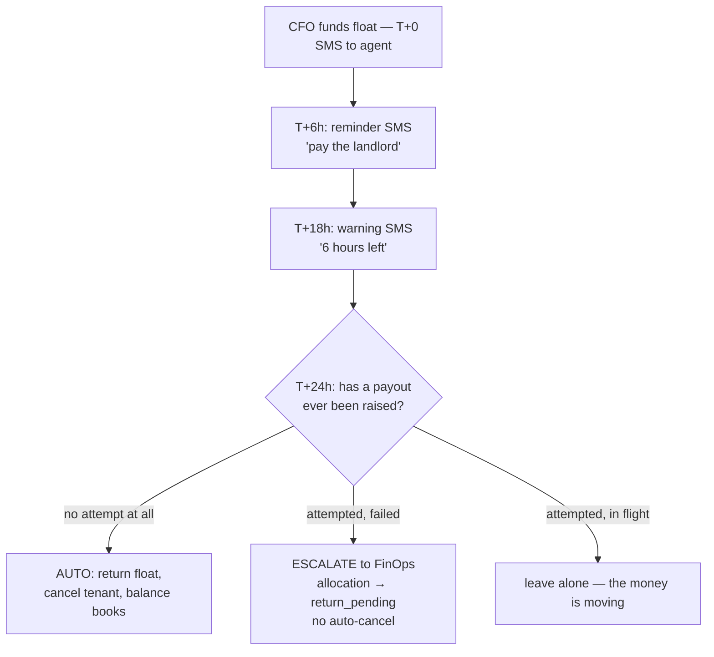

# Feedback: the repaying gate, the bonus rewrite, and fuzzy duplicate detection

**Third document in this series.** Follows
[`rent-plan-pipeline-and-commission-map.md`](./rent-plan-pipeline-and-commission-map.md)
(how it works) and
[`commission-policy-decisions-2026-09-23.md`](./commission-policy-decisions-2026-09-23.md)
(what was decided). This one is my response to the second round of decisions:
what already exists, what has to be built, and the four places I would push back.

Figures read from production **23 September 2026**. Nothing has been applied.

---

## Contents

1. [Decisions, and my read on each](#1-decisions-and-my-read-on-each)
2. [Duplicate detection by fuzzy name](#2-duplicate-detection-by-fuzzy-name)
3. [The bonus rewrite](#3-the-bonus-rewrite)
4. [Your two direct questions](#4-your-two-direct-questions)
5. [The big one: repaying means "the landlord has been paid"](#5-the-big-one-repaying-means-the-landlord-has-been-paid)
6. [The 24-hour return — where I would push back](#6-the-24-hour-return--where-i-would-push-back)
7. [What can be retired once this lands](#7-what-can-be-retired-once-this-lands)
8. [Build order](#8-build-order)

---

## 1. Decisions, and my read on each

| # | Decision | My read |
|---|---|---|
| 1 | Duplicate landlords/LC1 detected by **fuzzy name**, checked as the agent types. Phone left alone for now | **Agree.** The trigram index already exists for landlords. Make it a warning, not a hard block |
| 2 | The 5,000 funding bonus is paid **after the landlord float leaves the agent wallet** | **Strongly agree.** Pays for the job done, not the money received |
| 3 | Landlord verification: agent **2,000**, parent **nothing** | Agree. Drops the agent from 5,000 → 2,000 and ends a 7,405,000 override stream |
| 4 | LC1 verification: agent only, parent nothing | Agree. Agent already gets 2,000; only the override goes |
| 5 | Remove `trg_pay_listed_rent_posted_bonus` — rent request entry has no empty-house link | Agree, and your reason is the decisive one |
| 6 | `funded → repaying` happens when the landlord float **leaves the agent wallet** | **Agree with the principle.** One detail must come with it — see §5.2 |
| 7 | SMS to the agent when CFO sends landlord float to their wallet | Agree. Today there is an email and an in-app notification, **no SMS** |
| 8 | 24h without the float leaving → return it, cancel the tenant | **Agree with the timer, not with the automatic cancel.** See §6 |

---

## 2. Duplicate detection by fuzzy name

### What already exists

| Table | Name index | Fuzzy-capable? |
|---|---|---|
| `landlords` | `idx_landlords_name_trgm` — **GIN, `gin_trgm_ops`** | **yes** |
| `landlords` | `idx_landlords_phone_trgm` — GIN, `gin_trgm_ops` | yes |
| `lc1_chairpersons` | `idx_lc1_chairpersons_name` — btree on `lower(name)` | **no — exact only** |

`pg_trgm` is installed and already in use. Landlords are ready today; **LC1 needs a
GIN trigram index adding.**

### What has to be built

1. **A GIN trigram index on `lc1_chairpersons.name`**, matching the landlord one.
2. **A check-as-you-type RPC** — `find_similar_landlords(name, village_id)` and the
   LC1 equivalent — returning the top few matches with their similarity score,
   whether they are already verified, and who registered them. It should be
   `SECURITY DEFINER` and return *only* what the registration form needs: name,
   village, verified flag, registering agent. Not phone, not id documents.
3. **Narrow the search by geography.** `ug_village_id` exists on both tables.
   Ugandan names repeat heavily nationally and much less within one village, so
   `similarity(name) > threshold AND same village (or parish)` is far more precise
   than name alone.
4. **Two thresholds, two behaviours:**
   - `similarity ≥ 0.6` in the same village → **block, with the match shown.**
   - `similarity ≥ 0.4` anywhere, or `≥ 0.3` in the same village → **warn**, and
     let the agent proceed with a typed reason that is stored on the row.

### Why a warning and not a hard block

Genuine namesakes are common, and a hard block would make a real landlord
un-registrable with no way forward — the agent would work around it by entering a
slightly different spelling, which makes the duplicate problem worse, not better.
A recorded override gives the service-centre desk something to review.

### What this does not fix

Fuzzy name matching would not have caught the **289 duplicate phone groups**
(473 extra rows). Those are the same phone under different names. Leaving phone
alone for now is a reasonable sequencing call, but the phone duplicates are the
larger population and the one that duplicates payouts — worth returning to.

---

## 3. The bonus rewrite

### Before and after

| Event | Who | Now | After |
|---|---|---:|---:|
| House listed + verified | agent | 2,000 | 2,000 *(unchanged)* |
| House listed + verified | parent | 2,000 | 2,000 *(unchanged — not in scope)* |
| **Landlord verified** | **agent** | **5,000** | **2,000** |
| **Landlord verified** | **parent** | **3,000** | **0** |
| **LC1 verified** | agent | 2,000 | 2,000 *(unchanged)* |
| **LC1 verified** | **parent** | **3,000** | **0** |
| Rent request posted | agent | 0 *(typo)* | **0 (enforced)** |
| Any approval desk | anyone | 0 | 0 |
| **CFO funds landlord float** | **agent** | **5,000 + 10,000** | **0 at this moment** |
| **CFO funds landlord float** | **parent** | **3,000** | **0** |
| **Landlord float leaves the wallet** | **agent** | 1% of payout | **1% + 5,000** |
| Each collection | agent | 10% / 8% | unchanged |
| Each collection | parent | 2% | unchanged |

### What each change is worth, measured

All-time ledger totals for the streams being removed:

| Stream | Payments | UGX | Running since |
|---|---:|---:|---|
| Parent override, `landlord_verified` (3,000) | 2,473 | **7,405,000** | 2026-06-17 |
| Parent override, `tenant_landlord_funded` (3,000) | 390 | 1,170,000 | 2026-06-16 |
| Parent override, `lc1_chairperson_verified` (3,000) | 15 | 45,000 | 2026-06-15 |
| Event bonus, `rent_funded_landlord_float` (10,000) | 1,404 | **14,040,000** | 2026-07-28 |
| Pipeline landlord bonus (5,000, per rent request) | 1,177 | **5,885,000** | 2026-04-10 |

For scale, the agent-side streams being kept or reduced:

| Stream | Payments | UGX |
|---|---:|---:|
| Agent landlord registration bonus (5,000 → 2,000) | 2,030 | 10,150,000 |
| Agent LC1 registration bonus (2,000) | 15 | 33,000 |
| Parent override, `house_listed_verified` (2,000) | 5,608 | 14,206,000 |

**Reducing the landlord bonus from 5,000 to 2,000 and dropping the two overrides
takes roughly 3,000 + 3,000 = 6,000 out of every new verified landlord** — from
8,000 across two people down to 2,000 to one.

That is a substantial cut to acquisition pay. It is defensible — the collection
commission is where the real money is, and acquisition bonuses were being paid
several times for the same landlord — but agents will feel it immediately and
should be told before it lands, not after.

### Where the 5,000 moves to

Moving it to "after the landlord float leaves the wallet" is the right call: it
pays for the work the agent actually has to do, and it removes the perverse
position where an agent earned 15,000 the moment money arrived in their wallet and
nothing more for delivering it.

**One thing to decide.** There is already a **1% payout commission** firing at that
exact moment (`post_landlord_payout_finops_commission`). On a 450,000 payout that
is 4,500, so the agent would receive 4,500 + 5,000 = 9,500 in two separate ledger
groups at the same instant. That is the same "two payments, one event, neither
aware of the other" shape we just spent a document untangling. Either:

- **(a)** pay both from one function in one ledger group with one description, or
- **(b)** fold the 5,000 into the percentage and drop the flat part.

I would take (a) — the flat part rewards small payouts fairly, the percentage
scales with risk, and one group keeps it auditable.

---

## 4. Your two direct questions

### "`pay_listed_landlord_verified_bonus` — fires at Landlord Ops, only for new landlords?"

Close, but the mechanics differ in a way that matters.

It is an **AFTER UPDATE trigger on `landlords`**, not on `rent_requests`. It fires
on the condition:

```sql
IF NEW.verified = true AND (OLD.verified IS DISTINCT FROM true) THEN
```

So it fires **wherever the landlord is verified** — the Landlord Ops desk, the
Global Verification Hub, the service centre, a staff RPC. It is the *verification
event*, not a pipeline stage.

**On your concern — it already cannot fire for an already-verified landlord.**
It keys on the `false → true` transition, so a landlord who is already `verified`
can never trigger it again. That part is safe.

**The real problem is what it does next:**

```sql
FOR r IN SELECT rr.id, rr.agent_id, rr.tenant_id
         FROM rent_requests rr JOIN house_listings hl ON hl.id = rr.house_listing_id
         WHERE rr.landlord_id = NEW.id AND hl.verified = true
LOOP
  PERFORM credit_agent_event_bonus(r.agent_id, 'rent_landlord_verified', ...);
END LOOP;
```

It loops over **every rent request naming that landlord** and pays one bonus each.
A landlord with five rent requests would pay five bonuses at the instant of
verification — the same per-rent-request multiplication the pipeline bonus was
doing, just triggered differently.

It has never actually paid, because `'rent_landlord_verified'` is not one of the
eight keys `credit_agent_event_bonus` recognises — the same class of typo as
`rent_posted_listed`. **Drop it rather than fix it.** Under the new rule the
2,000 is paid once per landlord by `pay_landlord_registration_verified_bonus`,
which is already flag-guarded and idempotent.

### "So we might not need `credit_agent_event_bonus` in the landlord process?"

**Correct — and it is already not used there.**

| Path | Mechanism |
|---|---|
| `pay_landlord_registration_verified_bonus` (the one we keep) | `create_ledger_transaction` **directly**, key `landlord_reg_verify_v2:<id>` |
| `pay_lc1_registration_verified_bonus` (the one we keep) | `create_ledger_transaction` **directly**, key `lc1_reg_verify_v1:<id>` |
| `pay_listed_landlord_verified_bonus` (being dropped) | `credit_agent_event_bonus` — the only landlord-side user |

Once that trigger is dropped, **`credit_agent_event_bonus` has no involvement in
the landlord or LC1 process at all.** What remains of its price list:

| Event | Amount | Status after this round |
|---|---:|---|
| `house_listed` | 2,000 | live — keep |
| `subagent_registration` | 10,000 | live — keep |
| `three_verified_houses` | 10,000 | live (1 payment) — keep |
| `service_centre_setup` | 25,000 | keep, **needs wiring** |
| `tenant_placement` | 10,000 | keep, **needs wiring** |
| `rent_request_posted` | 5,000 | **delete** |
| `tenant_replacement` | 20,000 | **delete** |
| `rent_funded_landlord_float` | 10,000 | **delete** |

### On removing the submission bonus

Agreed, and your reason settles it: **the rent-request entry points have no option
to link an empty house**, so `NEW.house_listing_id` is essentially never set by an
agent posting normally. The trigger is unreachable in practice *and* mispriced
*and* misspelled. Drop the trigger and the function; do not leave a disabled 5,000
in the price list where a future tidy-up can switch it on.

---

## 5. The big one: repaying means "the landlord has been paid"

### 5.1 What you are proposing



This is the right shape. It replaces an *inferred* gate — "we think the landlord
was probably paid because the allocation shows a payout" — with a **state
transition that means exactly that**. Everything downstream gets simpler: the pin
bills from a date that is real, arrears mean what they say, and coverage stops
being diluted by plans that were never collectable.

### 5.2 The detail that must come with it

> **`repayment_starts_on` has to be re-stamped at the transition, not left at
> funding + 1.**

Today `rent_request_default_repayment_start` sets it to the day after funding. If
`repaying` starts three days later when the float leaves, but `repayment_starts_on`
still says funding + 1, the pin will bill **three days the agent could never have
collected** — and every one of them becomes permanent arrears the moment they are
pinned.

That is not hypothetical: it is precisely the failure that produced the phantom
day-1 arrears on Faizal Kayondo and Hamiss Mutyaba, and this change would
reproduce it at the scale of every funded plan.

So the transition must do both, in one statement:

```
status              := 'repaying'
repayment_starts_on := (the Kampala date the float left the wallet) + 1
```

Your existing next-day rule then works unchanged — it simply anchors to a
different, more honest day.

### 5.3 Which exact moment counts as "left the wallet"

There are four candidate points. They matter because 944 payouts are currently
resting in one of them:

| `landlord_payouts.status` | Live rows | Meaning | Suitable? |
|---|---:|---|---|
| `otp_verified` | 0 | landlord approved, money reserved not spent | too early — `get_agent_lp_float_available` only *reserves* here |
| `pending_merchant_payout` | 3 | dispatched to a merchant to pay out | **this is your stated point** |
| `awaiting_agent_receipt` | **944** | FinOps disbursed, receipt outstanding | **the books already agree here** |
| `completed` | 81 | agent submitted the receipt | far too late — only 8% ever reach it |

`completed` is out: with 944 sitting in `awaiting_agent_receipt` against 81
completed, waiting for it would mean almost nothing ever starts repaying.

**My recommendation: use the point the allocation already recognises** — the
statuses at which `apply_landlord_payout_to_allocation` bumps `paid_out_amount`
(`pending_finops_disbursement`, `awaiting_agent_receipt`, `disbursed`,
`completed`). Reasons:

- the ledger, the allocation and the 1% commission already all fire there, so
  `repaying` would agree with the books rather than running ahead of them;
- it is minutes after your stated point, not days;
- it needs no new state machine — one trigger on the same event.

If you want the earlier point (`pending_merchant_payout`) that is defensible too,
but then `repaying` can precede the money actually leaving, and a failed merchant
payout would leave a plan repaying against a landlord who was never paid. The
later point cannot do that.

### 5.4 What this fixes

| Problem | Today | After |
|---|---|---|
| Landlord-payout gate in `v_rent_plan_schedule` | live gate, re-evaluated every 00:05 | **redundant — delete the clause** |
| Day-1 pin gap | repaired by a 6-day catch-up | **cannot occur** |
| 25 plans invisible with no explanation | silent | they are `funded`, not `repaying` — a real, visible state |
| Agents billed for days before the landlord was paid | happens | impossible |
| "Is this plan collectable?" | inferred from three joins | **one column** |

---

## 6. The 24-hour return — where I would push back

The timer is right. **The automatic cancellation is where I would not go straight
to full automation**, for one reason that is already visible in the data.

### The problem: a failed payout is not an idle agent

**107 landlord payouts are currently `failed`, worth 74,700,000.** A payout fails
because a merchant could not pay, a telecom rejected it, or a number was wrong —
**not** because the agent sat on the money.

Your own example makes the case. Patience Ruba's plan (`6789bb19`):

| When | What happened |
|---|---|
| 2026-09-17 14:20 | CFO funded 450,000 to the agent's landlord float |
| 2026-09-18 10:00 | Agent raised the payout, landlord OTP verified |
| — | **payout failed** |
| 2026-09-23 12:10 | Agent raised it again — now `pending_merchant_payout` |

Under a blunt 24-hour auto-cancel, that tenant would have been **cancelled on
19 September**, five days before the agent's retry succeeded. The agent did
everything right, twice. The tenant loses their home financing because a merchant
payout failed.

### What I would build instead



The distinction is cheap to make: `landlord_payouts` either has a row for that
rent request or it does not.

- **No payout ever raised in 24h** → the agent has not acted. Auto-return and
  cancel. This is the case your rule is aimed at, and automating it is right.
- **Raised and failed** → escalate, alert FinOps, hold the float. Do not punish
  the agent or the tenant for infrastructure.
- **Raised and in flight** → do nothing. The money is already moving.

### Three more things the timer needs

1. **Warn before the deadline, not after.** An SMS at T+6h and T+18h costs almost
   nothing and will prevent most cancellations. Cancelling without warning will
   read to agents as the system taking money back arbitrarily.
2. **Tell the tenant.** A cancelled Rent Plan is a person who thought their rent
   was handled. They need an SMS too, and a route back — the request should be
   re-submittable, not dead.
3. **24h is a clock, not a working day.** Funding at 19:07 on a Friday gives an
   agent an overnight-plus-Saturday-morning window. Consider counting only
   business hours, or setting the deadline at end of the next working day. Of the
   plans funded this month, several were funded after 18:00.

### The machinery already exists

Encouragingly, most of what this needs is already built and tested:

| Need | Existing |
|---|---|
| Return float + cancel tenant + balance books | **`cancel_tenant_and_return_landlord_float(rent_request_id, reason)`** — CFO/COO/manager/ops/financial_ops, reason ≥ 10 chars, returns each allocation and posts the ledger groups |
| A request/approve path for returns | `agent_allocation_return_requests` + `cfo_decide_allocation_return`, with allocation status `return_pending` |
| Reverse one payout's effect | `refund_agent_float_for_payout` |
| A proven "promise not kept" timer | **`detect_unpaid_float_promises()`** — flags `float_requests` unpaid after 2h, escalates to `critical` at 12h, writes `float_promise_alerts`, auto-closes when paid. Runs every 15 minutes |

**`detect_unpaid_float_promises` is the exact pattern to copy** — same shape, same
alert table design, already running in production.

**One blocker:** `cancel_tenant_and_return_landlord_float` begins with

```sql
IF v_caller IS NULL THEN RAISE EXCEPTION 'AUTH_REQUIRED'; ...
```

A cron job has no `auth.uid()`. It needs either a service-role variant or a
`SECURITY DEFINER` wrapper that records a system actor, so the audit trail still
names *something* rather than a null.

---

## 7. What can be retired once this lands

Your message ends **"and i think we can retire this"** without naming it. Two
things become retirable, and I suspect you mean the first:

### The landlord-payout gate in `v_rent_plan_schedule`

```sql
AND (COALESCE(rr.amount_repaid,0) > 0
     OR le.rent_request_id IS NULL
     OR le.paid_out > 0
     OR COALESCE(le.open_allocs,0) = 0)
```

Once `repaying` *means* "the landlord has been paid", this clause is asking the
same question a second time, live, at 00:05 every night — and it is the live
re-evaluation that caused the day-1 gap. **Delete it and gate the pin on
`status = 'repaying'` instead.** That is the whole point of the redesign.

### The 6-day pin catch-up

`pin_agent_expected_day_catchup(6)` exists only to repair days the gate above
caused to be missed. With the gate gone and `repayment_starts_on` stamped at the
real transition, no day can go unpinned, and the lookback can drop to 0 or 1.

Keep `pin_agent_expected_day_for_plan` — it is cheap, idempotent, and useful as a
backstop. It is the **6-day sweep** that becomes noise.

> If you meant something else by "retire this", say which and I will assess it
> specifically rather than guess.

---

## 8. Build order

Nothing below has been applied.

### Phase 1 — bonus corrections (small, independent, stops the bleeding)

| # | Change |
|---|---|
| 1 | Drop `trg_pay_listed_rent_posted_bonus` + `pay_listed_rent_posted_bonus` |
| 2 | Drop `trg_pay_listed_landlord_verified_bonus` + `pay_listed_landlord_verified_bonus` |
| 3 | Remove `rent_request_posted`, `tenant_replacement`, `rent_funded_landlord_float` from `credit_agent_event_bonus`; drop `trg_credit_agent_rent_funded_bonus` |
| 4 | Drop `trg_recruiter_override_landlord_verified` and `trg_recruiter_override_lc1_verified` |
| 5 | Drop `trg_recruiter_override_tenant_landlord_funded` |
| 6 | `pay_landlord_registration_verified_bonus`: 5,000 → **2,000** |
| 7 | Remove the two `credit-landlord-verification-bonus` invocations from `RentPipelineQueue.tsx`; retire the edge function |
| 8 | **Tell the agents** before 1–7 land |

### Phase 2 — fuzzy duplicate detection (no behaviour change to money)

| # | Change |
|---|---|
| 9 | GIN trigram index on `lc1_chairpersons.name` |
| 10 | `find_similar_landlords()` / `find_similar_lc1()` RPCs, village-scoped |
| 11 | Check-as-you-type in both registration forms; warn + recorded override |

### Phase 3 — the repaying gate (the structural one)

| # | Change |
|---|---|
| 12 | SMS on landlord float funding (email and in-app already exist) |
| 13 | Trigger on the `paid_out_amount > 0` transition: `status := 'repaying'` **and** `repayment_starts_on := that Kampala day + 1` |
| 14 | Move the 5,000 to that same transition, in one ledger group with the existing 1% |
| 15 | Delete the payout-evidence clause from `v_rent_plan_schedule`; gate on `status = 'repaying'` |
| 16 | Reduce the pin catch-up lookback from 6 days |

### Phase 4 — the 24-hour timer

| # | Change |
|---|---|
| 17 | Reminder SMS at T+6h and warning at T+18h |
| 18 | Detector modelled on `detect_unpaid_float_promises`, with a `landlord_float_idle_alerts` table |
| 19 | Service-role variant of `cancel_tenant_and_return_landlord_float` with a system actor |
| 20 | **Auto-cancel only where no payout was ever attempted**; escalate the failed-payout case to FinOps |
| 21 | Tenant notification + a re-submission route for a cancelled request |

Phase 3 item 13 is the one that must not be got wrong. Everything else is
recoverable; stamping the wrong `repayment_starts_on` writes permanent arrears
into the pinned bill, and the bill is immutable by design.

---

## Terminology

Rent Plan (never "loan"), Supporter (never "lender"), Returns (never "interest" or
"ROI"). All amounts UGX.
